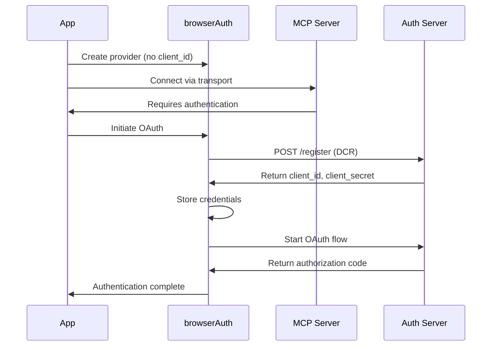

# browserAuth

The `browserAuth` function creates an OAuth provider that integrates seamlessly with the Model Context Protocol (MCP) SDK. It handles the entire OAuth flow including Dynamic Client Registration, token management, and automatic refresh — all through a browser-based authorization flow.

## Function Signature

```typescript
function browserAuth(options?: BrowserAuthOptions): OAuthClientProvider;
```

## Parameters

### BrowserAuthOptions

| Property       | Type                     | Default           | Description                        |
| -------------- | ------------------------ | ----------------- | ---------------------------------- |
| `clientId`     | `string`                 | _none_            | Pre-registered OAuth client ID     |
| `clientSecret` | `string`                 | _none_            | Pre-registered OAuth client secret |
| `scope`        | `string`                 | _none_            | OAuth scopes to request            |
| `port`         | `number`                 | `3000`            | Port for local callback server     |
| `hostname`     | `string`                 | `"localhost"`     | Hostname to bind server to         |
| `callbackPath` | `string`                 | `"/callback"`     | URL path for OAuth callback        |
| `store`        | `TokenStore`             | `inMemoryStore()` | Token storage implementation       |
| `storeKey`     | `string`                 | `"mcp-tokens"`    | Storage key prefix                 |
| `openBrowser`  | `boolean \| string`      | `true`            | Auto-open browser                  |
| `authTimeout`  | `number`                 | `300000`          | Auth timeout in ms (5 min)         |
| `usePKCE`      | `boolean`                | `true`            | Enable PKCE for security           |
| `successHtml`  | `string`                 | _built-in_        | Custom success page HTML           |
| `errorHtml`    | `string`                 | _built-in_        | Custom error page HTML             |
| `onRequest`    | `(req: Request) => void` | _none_            | Request logging callback           |

## Return Value

Returns an `OAuthClientProvider` instance that implements the MCP SDK authentication interface:

```typescript
interface OAuthClientProvider {
  // Called by MCP SDK for authentication
  redirectToAuthorization(authorizationUrl: URL): Promise<void>;

  // Token management
  tokens(): Promise<OAuthTokens | undefined>;
  saveTokens(tokens: OAuthTokens): Promise<void>;

  // Dynamic Client Registration support
  clientInformation(): Promise<OAuthClientInformation | undefined>;
  saveClientInformation(info: OAuthClientInformationFull): Promise<void>;

  // PKCE support
  codeVerifier(): Promise<string>;
  saveCodeVerifier(verifier: string): Promise<void>;

  // State management
  state(): Promise<string>;
  invalidateCredentials(
    scope: "all" | "client" | "tokens" | "verifier",
  ): Promise<void>;
}
```

## Basic Usage

### Simple MCP Client

The simplest usage with default settings:

```typescript
import { browserAuth } from "oauth-callback/mcp";
import { Client } from "@modelcontextprotocol/sdk/client/index.js";
import { StreamableHTTPClientTransport } from "@modelcontextprotocol/sdk/client/streamableHttp.js";

// Create OAuth provider with defaults
const authProvider = browserAuth();

// Use with MCP transport
const transport = new StreamableHTTPClientTransport(
  new URL("https://mcp.example.com"),
  { authProvider },
);

const client = new Client(
  { name: "my-app", version: "1.0.0" },
  { capabilities: {} },
);

await client.connect(transport);
```

### With Token Persistence

Store tokens across sessions:

```typescript
import { browserAuth, fileStore } from "oauth-callback/mcp";

const authProvider = browserAuth({
  store: fileStore(), // Persists to ~/.mcp/tokens.json
  scope: "read write",
});
```

## Advanced Usage

### Pre-Registered OAuth Clients

If you have pre-registered OAuth credentials:

```typescript
const authProvider = browserAuth({
  clientId: process.env.OAUTH_CLIENT_ID,
  clientSecret: process.env.OAUTH_CLIENT_SECRET,
  scope: "read write admin",
  store: fileStore(),
});
```

### Custom Storage Location

Store tokens in a specific location:

```typescript
import { browserAuth, fileStore } from "oauth-callback/mcp";

const authProvider = browserAuth({
  store: fileStore("/path/to/my-tokens.json"),
  storeKey: "my-app-production", // Namespace for multiple environments
});
```

### Custom Port and Callback Path

Configure the callback server:

```typescript
const authProvider = browserAuth({
  port: 8080,
  hostname: "127.0.0.1",
  callbackPath: "/oauth/callback",
  store: fileStore(),
});
```

::: warning Redirect URI Configuration
Ensure your OAuth app's redirect URI matches your configuration:

- Configuration: `port: 8080`, `callbackPath: "/oauth/callback"`
- Redirect URI: `http://localhost:8080/oauth/callback`
  :::

### Custom HTML Pages

Provide branded callback pages:

```typescript
const authProvider = browserAuth({
  successHtml: `
    <!DOCTYPE html>
    <html>
      <head>
        <title>Success!</title>
        <style>
          body {
            font-family: -apple-system, system-ui, sans-serif;
            display: flex;
            justify-content: center;
            align-items: center;
            height: 100vh;
            background: linear-gradient(135deg, #667eea 0%, #764ba2 100%);
            color: white;
            margin: 0;
          }
          .container {
            text-align: center;
            padding: 2rem;
          }
          h1 { font-size: 3rem; margin-bottom: 1rem; }
          p { font-size: 1.2rem; opacity: 0.9; }
        </style>
      </head>
      <body>
        <div class="container">
          <h1>🎉 Success!</h1>
          <p>Authorization complete. You can close this window.</p>
        </div>
      </body>
    </html>
  `,
  errorHtml: `
    <!DOCTYPE html>
    <html>
      <body>
        <h1>Authorization Failed</h1>
        <p>Error: {{error}}</p>
        <p>{{error_description}}</p>
      </body>
    </html>
  `,
});
```

### Request Logging

Monitor OAuth flow for debugging:

```typescript
const authProvider = browserAuth({
  onRequest: (req) => {
    const url = new URL(req.url);
    console.log(`[OAuth] ${req.method} ${url.pathname}`);

    if (url.pathname === "/callback") {
      console.log("[OAuth] Callback params:", url.searchParams.toString());
    }
  },
  store: fileStore(),
});
```

### Headless/CI Environment

Disable browser auto-opening for automated environments:

```typescript
const authProvider = browserAuth({
  openBrowser: false,
  authTimeout: 10000, // Shorter timeout for CI
  store: inMemoryStore(),
});
```

## Dynamic Client Registration

OAuth Callback supports [RFC 7591](https://www.rfc-editor.org/rfc/rfc7591.html) Dynamic Client Registration, allowing automatic OAuth client registration:

### How It Works



### DCR Example

No pre-registration needed:

```typescript
// No clientId or clientSecret required!
const authProvider = browserAuth({
  scope: "read write",
  store: fileStore(), // Persist dynamically registered client
});

// The provider will automatically:
// 1. Register a new OAuth client on first use
// 2. Store the client credentials
// 3. Reuse them for future sessions
```

### Benefits of DCR

- **Zero Configuration**: Users don't need to manually register OAuth apps
- **Automatic Setup**: Client registration happens transparently
- **Credential Persistence**: Registered clients are reused across sessions
- **Simplified Distribution**: Ship MCP clients without OAuth setup instructions

## Token Storage

### Storage Interfaces

OAuth Callback provides two storage interfaces:

#### TokenStore (Basic)

```typescript
interface TokenStore {
  get(key: string): Promise<Tokens | null>;
  set(key: string, tokens: Tokens): Promise<void>;
  delete(key: string): Promise<void>;
  clear(): Promise<void>;
}
```

#### OAuthStore (Extended)

```typescript
interface OAuthStore extends TokenStore {
  getClient(key: string): Promise<ClientInfo | null>;
  setClient(key: string, client: ClientInfo): Promise<void>;
  getSession(key: string): Promise<OAuthSession | null>;
  setSession(key: string, session: OAuthSession): Promise<void>;
}
```

### Built-in Implementations

#### In-Memory Store

Ephemeral storage (tokens lost on restart):

```typescript
import { browserAuth, inMemoryStore } from "oauth-callback/mcp";

const authProvider = browserAuth({
  store: inMemoryStore(),
});
```

**Use cases:**

- Development and testing
- Short-lived CLI sessions
- Maximum security (no persistence)

#### File Store

Persistent storage to JSON file:

```typescript
import { browserAuth, fileStore } from "oauth-callback/mcp";

// Default location: ~/.mcp/tokens.json
const authProvider = browserAuth({
  store: fileStore(),
});

// Custom location
const customAuth = browserAuth({
  store: fileStore("/path/to/tokens.json"),
});
```

**Use cases:**

- Desktop applications
- Long-running services
- Multi-session authentication

### Custom Storage Implementation

Implement your own storage backend:

```typescript
import { TokenStore, Tokens } from "oauth-callback/mcp";

class RedisStore implements TokenStore {
  constructor(private redis: RedisClient) {}

  async get(key: string): Promise<Tokens | null> {
    const data = await this.redis.get(key);
    return data ? JSON.parse(data) : null;
  }

  async set(key: string, tokens: Tokens): Promise<void> {
    await this.redis.set(key, JSON.stringify(tokens));
  }

  async delete(key: string): Promise<void> {
    await this.redis.del(key);
  }

  async clear(): Promise<void> {
    // Clear all tokens with pattern matching
    const keys = await this.redis.keys("mcp-tokens:*");
    if (keys.length > 0) {
      await this.redis.del(...keys);
    }
  }
}

// Use custom store
const authProvider = browserAuth({
  store: new RedisStore(redisClient),
});
```

## Security Features

### PKCE (Proof Key for Code Exchange)

PKCE is enabled by default for enhanced security:

```typescript
const authProvider = browserAuth({
  usePKCE: true, // Default: true
});
```

PKCE prevents authorization code interception attacks by:

1. Generating a cryptographic code verifier
2. Sending a hashed challenge with the authorization request
3. Proving possession of the verifier during token exchange

### State Parameter

The provider automatically generates secure state parameters:

```typescript
// State is automatically generated and validated
const authProvider = browserAuth();
// No manual state handling needed!
```

### Token Expiry Management

Tokens are automatically managed with expiry tracking:

```typescript
// The provider automatically:
// 1. Tracks token expiry time
// 2. Returns undefined for expired tokens
// 3. Attempts refresh when refresh tokens are available
```

### Secure Storage

File storage uses restrictive permissions:

```typescript
// Files are created with mode 0600 (owner read/write only)
const authProvider = browserAuth({
  store: fileStore(), // Secure file permissions
});
```

## Error Handling

### OAuth Errors

The provider handles OAuth-specific errors:

```typescript
try {
  await client.connect(transport);
} catch (error) {
  if (error.message.includes("access_denied")) {
    console.log("User cancelled authorization");
  } else if (error.message.includes("invalid_scope")) {
    console.log("Requested scope not available");
  } else {
    console.error("Connection failed:", error);
  }
}
```

### Retry Logic

The provider includes automatic retry for transient failures:

```typescript
// Built-in retry logic:
// - 3 attempts for authorization
// - Exponential backoff between retries
// - OAuth errors are not retried (user-actionable)
```

### Timeout Handling

Configure timeout for different scenarios:

```typescript
const authProvider = browserAuth({
  authTimeout: 600000, // 10 minutes for first-time setup
});
```

## Complete Examples

### Notion MCP Integration

Full example with Dynamic Client Registration:

```typescript
import { browserAuth, fileStore } from "oauth-callback/mcp";
import { Client } from "@modelcontextprotocol/sdk/client/index.js";
import { StreamableHTTPClientTransport } from "@modelcontextprotocol/sdk/client/streamableHttp.js";

async function connectToNotion() {
  // No client credentials needed - uses DCR!
  const authProvider = browserAuth({
    store: fileStore(), // Persist tokens and client registration
    scope: "read write",
    onRequest: (req) => {
      console.log(`[Notion OAuth] ${new URL(req.url).pathname}`);
    },
  });

  const transport = new StreamableHTTPClientTransport(
    new URL("https://mcp.notion.com/mcp"),
    { authProvider },
  );

  const client = new Client(
    { name: "notion-client", version: "1.0.0" },
    { capabilities: {} },
  );

  try {
    await client.connect(transport);
    console.log("Connected to Notion MCP!");

    // List available tools
    const tools = await client.listTools();
    console.log("Available tools:", tools);

    // Use a tool
    const result = await client.callTool("search", {
      query: "meeting notes",
    });
    console.log("Search results:", result);
  } catch (error) {
    console.error("Failed to connect:", error);
  } finally {
    await client.close();
  }
}

connectToNotion();
```

### Multi-Environment Configuration

Support development, staging, and production:

```typescript
import { browserAuth, fileStore } from "oauth-callback/mcp";

function createAuthProvider(environment: "dev" | "staging" | "prod") {
  const configs = {
    dev: {
      port: 3000,
      store: inMemoryStore(), // No persistence in dev
      authTimeout: 60000,
      onRequest: (req) => console.log("[DEV]", req.url),
    },
    staging: {
      port: 3001,
      store: fileStore("~/.mcp/staging-tokens.json"),
      storeKey: "staging",
      authTimeout: 120000,
    },
    prod: {
      port: 3002,
      store: fileStore("~/.mcp/prod-tokens.json"),
      storeKey: "production",
      authTimeout: 300000,
      clientId: process.env.PROD_CLIENT_ID,
      clientSecret: process.env.PROD_CLIENT_SECRET,
    },
  };

  return browserAuth(configs[environment]);
}

// Use appropriate environment
const authProvider = createAuthProvider(
  process.env.NODE_ENV as "dev" | "staging" | "prod",
);
```

### Token Refresh Implementation

While automatic refresh is pending full implementation, you can handle expired tokens:

```typescript
import { browserAuth, fileStore } from "oauth-callback/mcp";

const authProvider = browserAuth({
  store: fileStore(),
  scope: "offline_access", // Request refresh token
});

async function withTokenRefresh(client: Client, operation: () => Promise<any>) {
  try {
    return await operation();
  } catch (error) {
    if (
      error.message.includes("401") ||
      error.message.includes("unauthorized")
    ) {
      console.log("Token expired, re-authenticating...");

      // Clear expired tokens
      await authProvider.invalidateCredentials("tokens");

      // Reconnect (will trigger new auth)
      await client.reconnect();

      // Retry operation
      return await operation();
    }
    throw error;
  }
}

// Use with automatic retry
const result = await withTokenRefresh(client, async () => {
  return await client.callTool("get-data", {});
});
```

## Testing

### Unit Testing

Mock the OAuth provider for tests:

```typescript
import { vi, describe, it, expect } from "vitest";

// Create mock provider
const mockAuthProvider = {
  redirectToAuthorization: vi.fn(),
  tokens: vi.fn().mockResolvedValue({
    access_token: "test_token",
    token_type: "Bearer",
  }),
  saveTokens: vi.fn(),
  clientInformation: vi.fn(),
  saveClientInformation: vi.fn(),
  state: vi.fn().mockResolvedValue("test_state"),
  codeVerifier: vi.fn().mockResolvedValue("test_verifier"),
  saveCodeVerifier: vi.fn(),
  invalidateCredentials: vi.fn(),
};

describe("MCP Client", () => {
  it("should authenticate with OAuth", async () => {
    const transport = new StreamableHTTPClientTransport(
      new URL("https://test.example.com"),
      { authProvider: mockAuthProvider },
    );

    const client = new Client(
      { name: "test", version: "1.0.0" },
      { capabilities: {} },
    );

    await client.connect(transport);

    expect(mockAuthProvider.tokens).toHaveBeenCalled();
  });
});
```

### Integration Testing

Test with a mock OAuth server:

```typescript
import { browserAuth, inMemoryStore } from "oauth-callback/mcp";
import { createMockOAuthServer } from "./test-utils";

describe("OAuth Flow Integration", () => {
  let mockServer: MockOAuthServer;

  beforeAll(async () => {
    mockServer = createMockOAuthServer();
    await mockServer.start();
  });

  afterAll(async () => {
    await mockServer.stop();
  });

  it("should complete full OAuth flow", async () => {
    const authProvider = browserAuth({
      port: 3001,
      openBrowser: false, // Don't open browser in tests
      store: inMemoryStore(),
    });

    // Simulate OAuth flow
    await authProvider.redirectToAuthorization(
      new URL(`http://localhost:${mockServer.port}/authorize`),
    );

    const tokens = await authProvider.tokens();
    expect(tokens?.access_token).toBeDefined();
  });
});
```

## Troubleshooting

### Common Issues

::: details Port Already in Use

```typescript
// Use a different port
const authProvider = browserAuth({
  port: 8080, // Try alternative port
});
```

:::

::: details Tokens Not Persisting

```typescript
// Ensure you're using file store, not in-memory
const authProvider = browserAuth({
  store: fileStore(), // ✅ Persistent
  // store: inMemoryStore() // ❌ Lost on restart
});
```

:::

::: details DCR Not Working
Some servers may not support Dynamic Client Registration:

```typescript
// Fallback to pre-registered credentials
const authProvider = browserAuth({
  clientId: "your-client-id",
  clientSecret: "your-client-secret",
});
```

:::

::: details Browser Not Opening

```typescript
// Check if running in headless environment
const authProvider = browserAuth({
  openBrowser: process.env.CI !== "true",
});
```

:::

## API Compatibility

The `browserAuth` provider implements the MCP SDK's `OAuthClientProvider` interface:

| Method                    | Status               | Notes                      |
| ------------------------- | -------------------- | -------------------------- |
| `redirectToAuthorization` | ✅ Fully supported   | Opens browser for auth     |
| `tokens`                  | ✅ Fully supported   | Returns current tokens     |
| `saveTokens`              | ✅ Fully supported   | Persists to storage        |
| `clientInformation`       | ✅ Fully supported   | Returns client credentials |
| `saveClientInformation`   | ✅ Fully supported   | Stores DCR results         |
| `state`                   | ✅ Fully supported   | Generates secure state     |
| `codeVerifier`            | ✅ Fully supported   | PKCE verifier              |
| `saveCodeVerifier`        | ✅ Fully supported   | Stores PKCE verifier       |
| `invalidateCredentials`   | ✅ Fully supported   | Clears stored data         |
| `validateResourceURL`     | ✅ Returns undefined | Not applicable             |
| `getPendingAuthCode`      | ✅ Internal use      | Used by SDK                |

## Migration Guide

### From Manual OAuth to browserAuth

```typescript
// Before: Manual OAuth implementation
const code = await getAuthCode(authUrl);
const tokens = await exchangeCodeForTokens(code);
// Manual token storage and refresh...

// After: Using browserAuth
const authProvider = browserAuth({
  store: fileStore(),
});
// Automatic handling of entire OAuth flow!
```

### From In-Memory to Persistent Storage

```typescript
// Before: Tokens lost on restart
const authProvider = browserAuth();

// After: Tokens persist across sessions
const authProvider = browserAuth({
  store: fileStore(),
});
```

## Related APIs

- [`getAuthCode`](/api/get-auth-code) - Low-level OAuth code capture
- [`TokenStore`](/api/storage-providers) - Storage interface documentation
- [`OAuthError`](/api/oauth-error) - OAuth error handling
