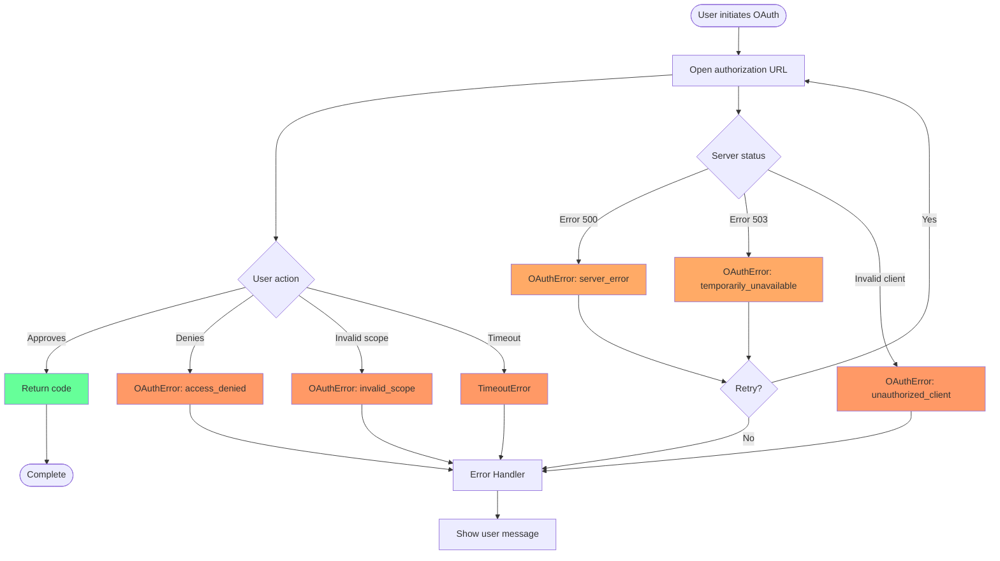

# OAuthError

The `OAuthError` class represents OAuth-specific errors that occur during the authorization flow. It extends the standard JavaScript `Error` class and provides structured access to OAuth error details as defined in [RFC 6749 Section 4.1.2.1](https://datatracker.ietf.org/doc/html/rfc6749#section-4.1.2.1).

## Class Definition

```typescript
class OAuthError extends Error {
  error: string; // OAuth error code
  error_description?: string; // Human-readable description
  error_uri?: string; // URI with more information

  constructor(error: string, description?: string, uri?: string);
}
```

## Properties

| Property            | Type                  | Description                                      |
| ------------------- | --------------------- | ------------------------------------------------ |
| `name`              | `string`              | Always `"OAuthError"` for instanceof checks      |
| `error`             | `string`              | OAuth error code (e.g., `"access_denied"`)       |
| `error_description` | `string \| undefined` | Human-readable error description                 |
| `error_uri`         | `string \| undefined` | URI with additional error information            |
| `message`           | `string`              | Inherited from Error (description or error code) |
| `stack`             | `string`              | Inherited stack trace from Error                 |

## OAuth Error Codes

According to [RFC 6749](https://datatracker.ietf.org/doc/html/rfc6749#section-4.1.2.1) and common provider extensions:

### Standard OAuth 2.0 Error Codes

| Error Code                  | Description                                         | User Action Required        |
| --------------------------- | --------------------------------------------------- | --------------------------- |
| `invalid_request`           | Request is missing required parameters or malformed | Fix request parameters      |
| `unauthorized_client`       | Client not authorized for this grant type           | Check client configuration  |
| `access_denied`             | User denied the authorization request               | User must approve access    |
| `unsupported_response_type` | Response type not supported                         | Use supported response type |
| `invalid_scope`             | Requested scope is invalid or unknown               | Request valid scopes        |
| `server_error`              | Authorization server error (500)                    | Retry later                 |
| `temporarily_unavailable`   | Server temporarily overloaded (503)                 | Retry with backoff          |

### Common Provider Extensions

| Error Code                   | Provider         | Description                    |
| ---------------------------- | ---------------- | ------------------------------ |
| `consent_required`           | Microsoft        | User consent needed            |
| `interaction_required`       | Microsoft        | User interaction needed        |
| `login_required`             | Google/Microsoft | User must authenticate         |
| `account_selection_required` | Microsoft        | User must select account       |
| `invalid_client`             | Various          | Client authentication failed   |
| `invalid_grant`              | Various          | Grant or refresh token invalid |

## Basic Usage

### Catching OAuth Errors

```typescript
import { getAuthCode, OAuthError } from "oauth-callback";

try {
  const result = await getAuthCode(authorizationUrl);
  console.log("Success! Code:", result.code);
} catch (error) {
  if (error instanceof OAuthError) {
    console.error(`OAuth error: ${error.error}`);
    if (error.error_description) {
      console.error(`Details: ${error.error_description}`);
    }
    if (error.error_uri) {
      console.error(`More info: ${error.error_uri}`);
    }
  } else {
    // Handle other errors (timeout, network, etc.)
    console.error("Unexpected error:", error);
  }
}
```

### Type Guard

```typescript
function isOAuthError(error: unknown): error is OAuthError {
  return error instanceof OAuthError;
}

// Usage
catch (error) {
  if (isOAuthError(error)) {
    // TypeScript knows error is OAuthError
    handleOAuthError(error.error, error.error_description);
  }
}
```

## Error Handling Patterns

### Comprehensive Error Handler

```typescript
import { OAuthError } from "oauth-callback";

async function handleOAuthFlow(authUrl: string) {
  try {
    const result = await getAuthCode(authUrl);
    return result.code;
  } catch (error) {
    if (error instanceof OAuthError) {
      switch (error.error) {
        case "access_denied":
          // User cancelled - this is expected
          console.log("User cancelled authorization");
          return null;

        case "invalid_scope":
          throw new Error(
            `Invalid permissions requested: ${error.error_description}`,
          );

        case "server_error":
        case "temporarily_unavailable":
          // Retry with exponential backoff
          console.warn("Server error, retrying...");
          await delay(1000);
          return handleOAuthFlow(authUrl);

        case "unauthorized_client":
          throw new Error(
            "Application not authorized. Please check OAuth app settings.",
          );

        default:
          // Unknown OAuth error
          throw new Error(
            `OAuth authorization failed: ${error.error_description || error.error}`,
          );
      }
    }

    // Non-OAuth errors
    throw error;
  }
}
```

### User-Friendly Error Messages

```typescript
function getErrorMessage(error: OAuthError): string {
  const messages: Record<string, string> = {
    access_denied: "You cancelled the authorization. Please try again when ready.",
    invalid_scope: "The requested permissions are not available.",
    server_error: "The authorization server encountered an error. Please try again.",
    temporarily_unavailable: "The service is temporarily unavailable. Please try again later.",
    unauthorized_client: "This application is not authorized. Please contact support.",
    invalid_request: "The authorization request was invalid. Please try again.",
    consent_required: "Please provide consent to continue.",
    login_required: "Please log in to continue.",
    interaction_required: "Additional interaction is required. Please complete the authorization in your browser."
  };

  return messages[error.error] ||
    error.error_description ||
    `Authorization failed: ${error.error}`;
}

// Usage
catch (error) {
  if (error instanceof OAuthError) {
    const userMessage = getErrorMessage(error);
    showUserNotification(userMessage);
  }
}
```

### Retry Logic

```typescript
async function authorizeWithRetry(
  authUrl: string,
  maxAttempts = 3,
): Promise<string> {
  let lastError: Error | undefined;

  for (let attempt = 1; attempt <= maxAttempts; attempt++) {
    try {
      const result = await getAuthCode(authUrl);
      return result.code;
    } catch (error) {
      lastError = error as Error;

      if (error instanceof OAuthError) {
        // Don't retry user-actionable errors
        if (
          ["access_denied", "invalid_scope", "unauthorized_client"].includes(
            error.error,
          )
        ) {
          throw error;
        }

        // Retry server errors
        if (["server_error", "temporarily_unavailable"].includes(error.error)) {
          const delay = Math.min(1000 * Math.pow(2, attempt - 1), 10000);
          console.warn(`Attempt ${attempt} failed, retrying in ${delay}ms...`);
          await new Promise((resolve) => setTimeout(resolve, delay));
          continue;
        }
      }

      // Don't retry other errors
      throw error;
    }
  }

  throw lastError || new Error("Authorization failed after retries");
}
```

## Error Recovery Strategies

### Graceful Degradation

```typescript
class OAuthService {
  private cachedToken?: string;

  async getAccessToken(): Promise<string | null> {
    try {
      // Try to get fresh token
      const code = await getAuthCode(this.authUrl);
      const token = await this.exchangeCodeForToken(code);
      this.cachedToken = token;
      return token;
    } catch (error) {
      if (error instanceof OAuthError) {
        if (error.error === "access_denied") {
          // User cancelled - try using cached token if available
          if (this.cachedToken) {
            console.log("Using cached token after user cancellation");
            return this.cachedToken;
          }
          return null;
        }

        if (error.error === "temporarily_unavailable" && this.cachedToken) {
          // Service down - use cached token
          console.warn("OAuth service unavailable, using cached token");
          return this.cachedToken;
        }
      }

      throw error;
    }
  }
}
```

### Error Logging

```typescript
import { OAuthError } from "oauth-callback";

function logOAuthError(error: OAuthError, context: Record<string, any>) {
  const errorLog = {
    timestamp: new Date().toISOString(),
    type: "oauth_error",
    error_code: error.error,
    error_description: error.error_description,
    error_uri: error.error_uri,
    context,
    stack: error.stack
  };

  // Send to logging service
  if (["server_error", "temporarily_unavailable"].includes(error.error)) {
    console.error("OAuth provider error:", errorLog);
    // Report to monitoring service
    reportToMonitoring(errorLog);
  } else {
    console.warn("OAuth user error:", errorLog);
    // Track user analytics
    trackUserEvent("oauth_error", { code: error.error });
  }
}

// Usage
catch (error) {
  if (error instanceof OAuthError) {
    logOAuthError(error, {
      provider: "github",
      client_id: CLIENT_ID,
      scopes: ["user:email", "repo"]
    });
  }
}
```

## Testing OAuth Errors

### Unit Testing

```typescript
import { OAuthError } from "oauth-callback";
import { describe, it, expect } from "vitest";

describe("OAuthError", () => {
  it("should create error with all properties", () => {
    const error = new OAuthError(
      "invalid_scope",
      "The requested scope is invalid",
      "https://example.com/docs/scopes",
    );

    expect(error).toBeInstanceOf(Error);
    expect(error).toBeInstanceOf(OAuthError);
    expect(error.name).toBe("OAuthError");
    expect(error.error).toBe("invalid_scope");
    expect(error.error_description).toBe("The requested scope is invalid");
    expect(error.error_uri).toBe("https://example.com/docs/scopes");
    expect(error.message).toBe("The requested scope is invalid");
  });

  it("should use error code as message when description is missing", () => {
    const error = new OAuthError("access_denied");
    expect(error.message).toBe("access_denied");
  });
});
```

### Mock OAuth Errors

```typescript
import { OAuthError } from "oauth-callback";

class MockOAuthProvider {
  private shouldFail: string | null = null;

  simulateError(errorCode: string) {
    this.shouldFail = errorCode;
  }

  async authorize(): Promise<string> {
    if (this.shouldFail) {
      throw new OAuthError(
        this.shouldFail,
        this.getErrorDescription(this.shouldFail),
        "https://example.com/oauth/errors",
      );
    }
    return "mock_auth_code";
  }

  private getErrorDescription(code: string): string {
    const descriptions: Record<string, string> = {
      access_denied: "User denied access to the application",
      invalid_scope: "One or more scopes are invalid",
      server_error: "Authorization server encountered an error",
    };
    return descriptions[code] || "Unknown error";
  }
}

// Usage in tests
describe("OAuth Flow", () => {
  it("should handle access_denied error", async () => {
    const provider = new MockOAuthProvider();
    provider.simulateError("access_denied");

    await expect(provider.authorize()).rejects.toThrow(OAuthError);
    await expect(provider.authorize()).rejects.toThrow("User denied access");
  });
});
```

## Integration with MCP

When using with the MCP SDK through `browserAuth()`:

```typescript
import { browserAuth } from "oauth-callback/mcp";
import { Client } from "@modelcontextprotocol/sdk/client/index.js";

async function connectWithErrorHandling() {
  const authProvider = browserAuth({
    store: fileStore(),
    onRequest: (req) => {
      // Log OAuth flow for debugging
      console.log(`OAuth: ${req.url}`);
    },
  });

  const client = new Client(
    { name: "my-app", version: "1.0.0" },
    { capabilities: {} },
  );

  try {
    await client.connect(transport);
  } catch (error) {
    // OAuth errors from browserAuth are wrapped
    if (error.message?.includes("OAuthError")) {
      // Extract OAuth error details
      const match = error.message.match(/OAuthError: (\w+)/);
      if (match) {
        const errorCode = match[1];
        console.error(`OAuth failed with code: ${errorCode}`);

        if (errorCode === "access_denied") {
          console.log("User cancelled MCP authorization");
          return null;
        }
      }
    }
    throw error;
  }
}
```

## Error Flow Diagram



## Best Practices

### 1. Always Check Error Type

```typescript
catch (error) {
  if (error instanceof OAuthError) {
    // Handle OAuth-specific errors
  } else if (error.message === "Timeout waiting for callback") {
    // Handle timeout
  } else {
    // Handle unexpected errors
  }
}
```

### 2. Log Errors Appropriately

```typescript
if (error instanceof OAuthError) {
  if (error.error === "access_denied") {
    // User action - info level
    console.info("User cancelled OAuth flow");
  } else if (
    ["server_error", "temporarily_unavailable"].includes(error.error)
  ) {
    // Provider issue - error level
    console.error("OAuth provider error:", error);
  } else {
    // Configuration issue - warning level
    console.warn("OAuth configuration error:", error);
  }
}
```

### 3. Provide Clear User Feedback

```typescript
function getUserMessage(error: OAuthError): string {
  // Prefer provider's description if available
  if (error.error_description) {
    return error.error_description;
  }

  // Fall back to generic messages
  return userFriendlyMessages[error.error] || "Authorization failed";
}
```

### 4. Handle Errors at the Right Level

```typescript
// Low level - preserve error details
async function getOAuthCode(url: string) {
  const result = await getAuthCode(url);
  // Let OAuthError propagate up
  return result.code;
}

// High level - translate to user actions
async function authenticateUser() {
  try {
    const code = await getOAuthCode(authUrl);
    return { success: true, code };
  } catch (error) {
    if (error instanceof OAuthError && error.error === "access_denied") {
      return { success: false, cancelled: true };
    }
    return { success: false, error: error.message };
  }
}
```

## Related APIs

- [`getAuthCode`](/api/get-auth-code) - Main function that throws OAuthError
- [`browserAuth`](/api/browser-auth) - MCP provider that handles OAuth errors
- [`TimeoutError`](#timeouterror) - Related timeout error class

## TimeoutError

The library also exports a `TimeoutError` class for timeout-specific failures:

```typescript
class TimeoutError extends Error {
  name: "TimeoutError";
  constructor(message?: string);
}
```

Usage:

```typescript
catch (error) {
  if (error instanceof TimeoutError) {
    console.error("OAuth flow timed out");
    // Suggest user tries again
  }
}
```
