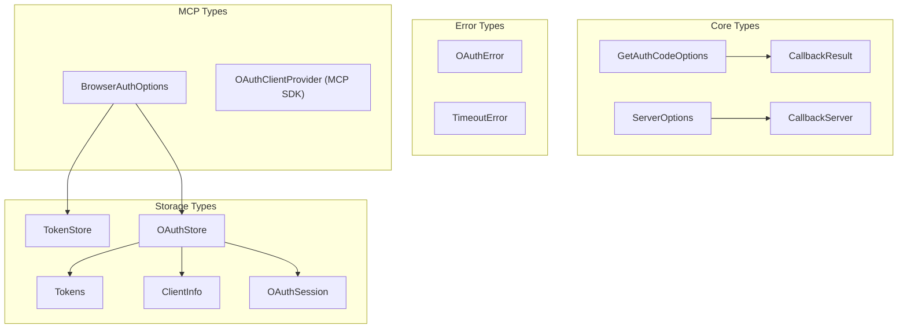

# TypeScript Types

OAuth Callback is fully typed with TypeScript, providing comprehensive type safety and excellent IDE support. This page documents all exported types and interfaces available in the library.

## Type Organization



## Core Types

### GetAuthCodeOptions

Configuration options for the `getAuthCode` function.

```typescript
interface GetAuthCodeOptions {
  authorizationUrl: string; // OAuth authorization URL
  port?: number; // Server port (default: 3000)
  hostname?: string; // Hostname (default: "localhost")
  callbackPath?: string; // Callback path (default: "/callback")
  timeout?: number; // Timeout in ms (default: 30000)
  openBrowser?: boolean; // Auto-open browser (default: true)
  successHtml?: string; // Custom success HTML
  errorHtml?: string; // Custom error HTML template
  signal?: AbortSignal; // Cancellation signal
  onRequest?: (req: Request) => void; // Request callback
}
```

#### Usage Example

```typescript
import type { GetAuthCodeOptions } from "oauth-callback";

const options: GetAuthCodeOptions = {
  authorizationUrl: "https://oauth.example.com/authorize?...",
  port: 8080,
  timeout: 60000,
  successHtml: "<h1>Success!</h1>",
  errorHtml: "<h1>Error: {{error_description}}</h1>",
  onRequest: (req) => console.log(`Request: ${req.url}`),
};

const result = await getAuthCode(options);
```

### CallbackResult

Result object returned from OAuth callback containing authorization code or error details.

```typescript
interface CallbackResult {
  code?: string; // Authorization code
  state?: string; // State parameter for CSRF
  error?: string; // OAuth error code
  error_description?: string; // Error description
  error_uri?: string; // Error info URI
  [key: string]: string | undefined; // Additional params
}
```

#### Usage Example

```typescript
import type { CallbackResult } from "oauth-callback";

function handleCallback(result: CallbackResult) {
  if (result.error) {
    console.error(`OAuth error: ${result.error}`);
    if (result.error_description) {
      console.error(`Details: ${result.error_description}`);
    }
    return;
  }

  if (result.code) {
    console.log(`Authorization code: ${result.code}`);

    // Validate state for CSRF protection
    if (result.state !== expectedState) {
      throw new Error("State mismatch - possible CSRF attack");
    }

    // Exchange code for tokens
    exchangeCodeForTokens(result.code);
  }
}
```

### ServerOptions

Configuration options for the OAuth callback server.

```typescript
interface ServerOptions {
  port: number; // Port to bind to
  hostname?: string; // Hostname (default: "localhost")
  successHtml?: string; // Custom success HTML
  errorHtml?: string; // Error HTML template
  signal?: AbortSignal; // Cancellation signal
  onRequest?: (req: Request) => void; // Request callback
}
```

#### Usage Example

```typescript
import type { ServerOptions } from "oauth-callback";

const serverOptions: ServerOptions = {
  port: 3000,
  hostname: "127.0.0.1",
  successHtml: `
    <html>
      <body>
        <h1>Authorization successful!</h1>
        <script>window.close()</script>
      </body>
    </html>
  `,
  onRequest: (req) => {
    const url = new URL(req.url);
    console.log(`[${req.method}] ${url.pathname}`);
  },
};
```

### CallbackServer

Interface for OAuth callback server implementations across different runtimes.

```typescript
interface CallbackServer {
  start(options: ServerOptions): Promise<void>;
  waitForCallback(path: string, timeout: number): Promise<CallbackResult>;
  stop(): Promise<void>;
}
```

#### Implementation Example

```typescript
import type {
  CallbackServer,
  ServerOptions,
  CallbackResult,
} from "oauth-callback";

class CustomCallbackServer implements CallbackServer {
  private server?: HttpServer;

  async start(options: ServerOptions): Promise<void> {
    // Start HTTP server
    this.server = await createServer(options);
  }

  async waitForCallback(
    path: string,
    timeout: number,
  ): Promise<CallbackResult> {
    // Wait for OAuth callback
    return new Promise((resolve, reject) => {
      const timer = setTimeout(() => {
        reject(new Error("Timeout waiting for callback"));
      }, timeout);

      this.server.on("request", (req) => {
        if (req.url.startsWith(path)) {
          clearTimeout(timer);
          const params = parseQueryParams(req.url);
          resolve(params);
        }
      });
    });
  }

  async stop(): Promise<void> {
    // Stop server
    await this.server?.close();
  }
}
```

## Storage Types

### TokenStore

Basic interface for OAuth token storage.

```typescript
interface TokenStore {
  get(key: string): Promise<Tokens | null>;
  set(key: string, tokens: Tokens): Promise<void>;
  delete(key: string): Promise<void>;
  clear(): Promise<void>;
}
```

### Tokens

OAuth token data structure.

```typescript
interface Tokens {
  accessToken: string; // OAuth access token
  refreshToken?: string; // Optional refresh token
  expiresAt?: number; // Absolute expiry (Unix ms)
  scope?: string; // Space-delimited scopes
}
```

#### Usage Example

```typescript
import type { Tokens, TokenStore } from "oauth-callback/mcp";

class CustomTokenStore implements TokenStore {
  private storage = new Map<string, Tokens>();

  async get(key: string): Promise<Tokens | null> {
    return this.storage.get(key) ?? null;
  }

  async set(key: string, tokens: Tokens): Promise<void> {
    // Check if token is expired
    if (tokens.expiresAt && Date.now() >= tokens.expiresAt) {
      console.warn("Storing expired token");
    }
    this.storage.set(key, tokens);
  }

  async delete(key: string): Promise<void> {
    this.storage.delete(key);
  }

  async clear(): Promise<void> {
    this.storage.clear();
  }
}
```

### OAuthStore

Extended storage interface with Dynamic Client Registration support.

```typescript
interface OAuthStore extends TokenStore {
  getClient(key: string): Promise<ClientInfo | null>;
  setClient(key: string, client: ClientInfo): Promise<void>;
  getSession(key: string): Promise<OAuthSession | null>;
  setSession(key: string, session: OAuthSession): Promise<void>;
}
```

### ClientInfo

Dynamic client registration data.

```typescript
interface ClientInfo {
  clientId: string; // OAuth client ID
  clientSecret?: string; // Client secret
  clientIdIssuedAt?: number; // Registration time
  clientSecretExpiresAt?: number; // Secret expiry
}
```

### OAuthSession

Active OAuth flow state for crash recovery.

```typescript
interface OAuthSession {
  codeVerifier?: string; // PKCE code verifier
  state?: string; // OAuth state parameter
}
```

#### Complete Storage Example

```typescript
import type {
  OAuthStore,
  Tokens,
  ClientInfo,
  OAuthSession,
} from "oauth-callback/mcp";

class DatabaseOAuthStore implements OAuthStore {
  constructor(private db: Database) {}

  // TokenStore methods
  async get(key: string): Promise<Tokens | null> {
    return await this.db.tokens.findOne({ key });
  }

  async set(key: string, tokens: Tokens): Promise<void> {
    await this.db.tokens.upsert({ key }, tokens);
  }

  async delete(key: string): Promise<void> {
    await this.db.tokens.delete({ key });
  }

  async clear(): Promise<void> {
    await this.db.tokens.deleteMany({});
  }

  // OAuthStore additional methods
  async getClient(key: string): Promise<ClientInfo | null> {
    return await this.db.clients.findOne({ key });
  }

  async setClient(key: string, client: ClientInfo): Promise<void> {
    // Check if client secret is expired
    if (
      client.clientSecretExpiresAt &&
      Date.now() >= client.clientSecretExpiresAt
    ) {
      throw new Error("Cannot store expired client secret");
    }
    await this.db.clients.upsert({ key }, client);
  }

  async getSession(key: string): Promise<OAuthSession | null> {
    return await this.db.sessions.findOne({ key });
  }

  async setSession(key: string, session: OAuthSession): Promise<void> {
    await this.db.sessions.upsert({ key }, session);
  }
}
```

## MCP Types

### BrowserAuthOptions

Configuration for browser-based OAuth flows with MCP servers.

```typescript
interface BrowserAuthOptions {
  // OAuth credentials
  clientId?: string; // Pre-registered client ID
  clientSecret?: string; // Pre-registered secret
  scope?: string; // OAuth scopes

  // Server configuration
  port?: number; // Callback port (default: 3000)
  hostname?: string; // Hostname (default: "localhost")
  callbackPath?: string; // Path (default: "/callback")

  // Storage
  store?: TokenStore; // Token storage
  storeKey?: string; // Storage key prefix

  // Behavior
  openBrowser?: boolean | string; // Browser control
  authTimeout?: number; // Timeout ms (default: 300000)
  usePKCE?: boolean; // Enable PKCE (default: true)

  // UI
  successHtml?: string; // Success page HTML
  errorHtml?: string; // Error page template

  // Debugging
  onRequest?: (req: Request) => void; // Request logger
}
```

#### Usage Example

```typescript
import type { BrowserAuthOptions } from "oauth-callback/mcp";
import { browserAuth, fileStore } from "oauth-callback/mcp";

const options: BrowserAuthOptions = {
  // Dynamic Client Registration - no credentials needed
  scope: "read write",

  // Custom server configuration
  port: 8080,
  hostname: "127.0.0.1",

  // Persistent storage
  store: fileStore("~/.myapp/tokens.json"),
  storeKey: "production",

  // Security
  usePKCE: true,
  authTimeout: 600000, // 10 minutes

  // Custom UI
  successHtml: "<h1>Success!</h1>",

  // Debugging
  onRequest: (req) => {
    console.log(`[OAuth] ${new URL(req.url).pathname}`);
  },
};

const authProvider = browserAuth(options);
```

## Error Types

### OAuthError

OAuth-specific error class.

```typescript
class OAuthError extends Error {
  name: "OAuthError";
  error: string; // OAuth error code
  error_description?: string; // Human-readable description
  error_uri?: string; // Info URI

  constructor(error: string, description?: string, uri?: string);
}
```

### TimeoutError

Timeout-specific error class.

```typescript
class TimeoutError extends Error {
  name: "TimeoutError";
  constructor(message?: string);
}
```

#### Error Handling Example

```typescript
import { OAuthError, TimeoutError } from "oauth-callback";
import type { CallbackResult } from "oauth-callback";

function handleAuthResult(result: CallbackResult) {
  // Check for OAuth errors in result
  if (result.error) {
    throw new OAuthError(
      result.error,
      result.error_description,
      result.error_uri,
    );
  }

  if (!result.code) {
    throw new Error("No authorization code received");
  }

  return result.code;
}

// Usage with proper error handling
try {
  const code = await getAuthCode(authUrl);
} catch (error) {
  if (error instanceof OAuthError) {
    console.error(`OAuth error: ${error.error}`);
  } else if (error instanceof TimeoutError) {
    console.error("Authorization timed out");
  } else {
    console.error("Unexpected error:", error);
  }
}
```

## Type Guards

Useful type guard functions for runtime type checking:

```typescript
import type { Tokens, ClientInfo, OAuthSession } from "oauth-callback/mcp";

// Check if object is Tokens
function isTokens(obj: unknown): obj is Tokens {
  return (
    typeof obj === "object" &&
    obj !== null &&
    "accessToken" in obj &&
    typeof (obj as any).accessToken === "string"
  );
}

// Check if object is ClientInfo
function isClientInfo(obj: unknown): obj is ClientInfo {
  return (
    typeof obj === "object" &&
    obj !== null &&
    "clientId" in obj &&
    typeof (obj as any).clientId === "string"
  );
}

// Check if object is OAuthSession
function isOAuthSession(obj: unknown): obj is OAuthSession {
  return (
    typeof obj === "object" &&
    obj !== null &&
    ("codeVerifier" in obj || "state" in obj)
  );
}

// Check if error is OAuthError
function isOAuthError(error: unknown): error is OAuthError {
  return error instanceof OAuthError;
}

// Usage
const stored = await store.get("key");
if (stored && isTokens(stored)) {
  console.log("Valid tokens:", stored.accessToken);
}
```

## Generic Type Patterns

### Result Type Pattern

```typescript
type Result<T, E = Error> =
  | { success: true; data: T }
  | { success: false; error: E };

async function safeGetAuthCode(
  url: string,
): Promise<Result<CallbackResult, OAuthError | Error>> {
  try {
    const result = await getAuthCode(url);
    return { success: true, data: result };
  } catch (error) {
    if (error instanceof OAuthError) {
      return { success: false, error };
    }
    return { success: false, error: error as Error };
  }
}

// Usage
const result = await safeGetAuthCode(authUrl);
if (result.success) {
  console.log("Code:", result.data.code);
} else {
  console.error("Error:", result.error.message);
}
```

### Storage Adapter Pattern

```typescript
type StorageAdapter<T> = {
  load(): Promise<T | null>;
  save(data: T): Promise<void>;
  remove(): Promise<void>;
};

function createStorageAdapter<T>(
  store: TokenStore,
  key: string,
): StorageAdapter<T> {
  return {
    async load() {
      const data = await store.get(key);
      return data as T | null;
    },
    async save(data: T) {
      await store.set(key, data as any);
    },
    async remove() {
      await store.delete(key);
    },
  };
}
```

## Type Exports

### Main Package Exports

```typescript
// From "oauth-callback"
export type {
  GetAuthCodeOptions,
  CallbackResult,
  CallbackServer,
  ServerOptions,
};

export { getAuthCode, OAuthError, inMemoryStore, fileStore };
```

### MCP Sub-Package Exports

```typescript
// From "oauth-callback/mcp"
export type {
  BrowserAuthOptions,
  TokenStore,
  OAuthStore,
  Tokens,
  ClientInfo,
  OAuthSession,
};

export { browserAuth, inMemoryStore, fileStore };
```

### Namespace Export

```typescript
// Also available via namespace
import { mcp } from "oauth-callback";

// All MCP types and functions under mcp namespace
const authProvider = mcp.browserAuth({
  store: mcp.fileStore(),
});
```

## TypeScript Configuration

For optimal type support, use these TypeScript settings:

```json
{
  "compilerOptions": {
    "target": "ES2020",
    "module": "ESNext",
    "moduleResolution": "bundler",
    "strict": true,
    "esModuleInterop": true,
    "skipLibCheck": true,
    "forceConsistentCasingInFileNames": true,
    "types": ["node", "bun-types"]
  }
}
```

## Type Versioning

The library follows semantic versioning for types:

- **Major version**: Breaking type changes
- **Minor version**: New types or optional properties
- **Patch version**: Type fixes that don't break compatibility

## Related Documentation

- [`getAuthCode`](/api/get-auth-code) - Main function using these types
- [`browserAuth`](/api/browser-auth) - MCP provider using these types
- [`Storage Providers`](/api/storage-providers) - Storage type implementations
- [`OAuthError`](/api/oauth-error) - Error type documentation
