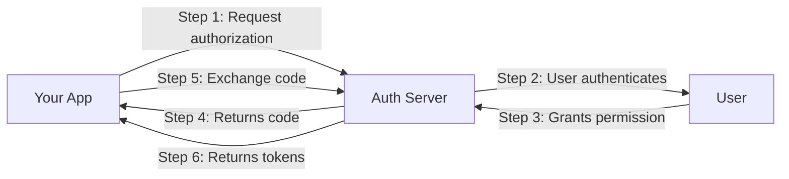
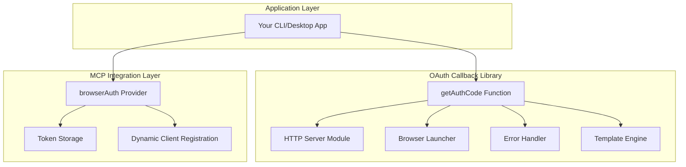
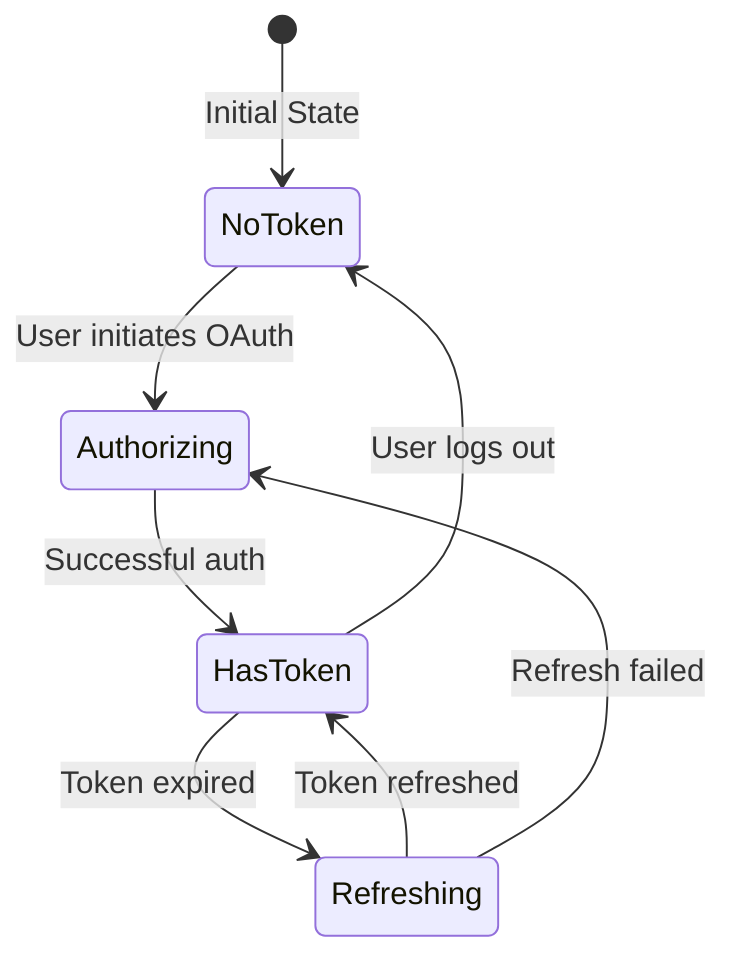
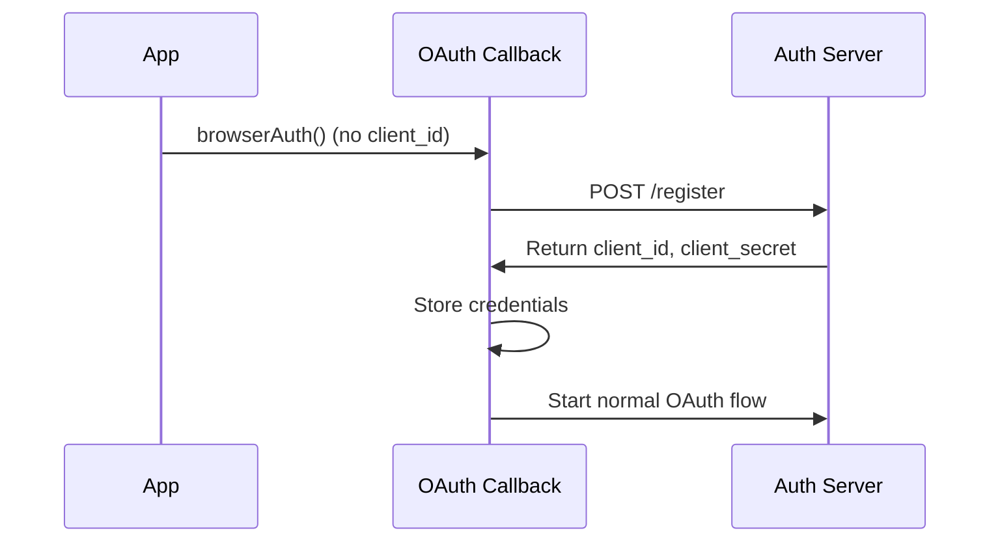
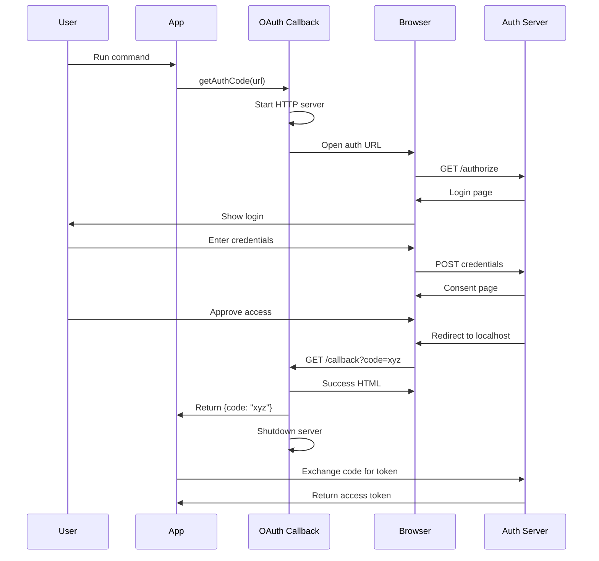

# Core Concepts {#top}

Understanding the core concepts behind **OAuth Callback** will help you build robust OAuth integrations in your CLI tools, desktop applications, and MCP clients. This page covers the fundamental patterns, architectural decisions, and key abstractions that power the library.

## The Authorization Code Flow

OAuth Callback implements the OAuth 2.0 Authorization Code Flow, the most secure flow for applications that can protect client secrets. This flow involves three key participants:



### Why Authorization Code Flow?

The authorization code flow provides several security benefits:

- **No token exposure**: Access tokens never pass through the browser
- **Short-lived codes**: Authorization codes expire quickly (typically 10 minutes)
- **Server verification**: The auth server can verify the client's identity
- **Refresh capability**: Supports refresh tokens for long-lived access

## The Localhost Callback Pattern

The core innovation of OAuth Callback is making the localhost callback pattern trivially simple to implement. This pattern, standardized in [RFC 8252](https://www.rfc-editor.org/rfc/rfc8252.html), solves a fundamental problem: how can native applications receive OAuth callbacks without a public web server?

### The Problem

Traditional web applications have public URLs where OAuth providers can send callbacks:

```
https://myapp.com/oauth/callback?code=xyz123
```

But CLI tools and desktop apps don't have public URLs. They run on the user's machine behind firewalls and NAT.

### The Solution

OAuth Callback creates a temporary HTTP server on localhost that:

1. **Binds locally**: Only accepts connections from `127.0.0.1`
2. **Uses dynamic ports**: Works with any available port
3. **Auto-terminates**: Shuts down after receiving the callback
4. **Handles edge cases**: Timeouts, errors, user cancellation

```typescript
// This single function handles all the complexity
const result = await getAuthCode(authorizationUrl);
```

## Architecture Overview

OAuth Callback is built on a layered architecture that separates concerns and enables flexibility:



### Core Components

#### 1. The HTTP Server (`server.ts`)

The heart of OAuth Callback is a lightweight HTTP server that:

- Listens on localhost for the OAuth callback
- Parses query parameters from the redirect
- Serves success/error HTML pages
- Implements proper cleanup on completion

```typescript
// Internally, the server handles:
- Request routing (/callback path matching)
- Query parameter extraction (code, state, error)
- HTML template rendering with placeholders
- Graceful shutdown after callback
```

#### 2. The Authorization Handler (`getAuthCode`)

The main API surface that orchestrates the entire flow:

```typescript
interface GetAuthCodeOptions {
  authorizationUrl: string; // OAuth provider URL
  port?: number; // Server port (default: 3000)
  timeout?: number; // Timeout in ms (default: 30000)
  openBrowser?: boolean; // Auto-open browser (default: true)
  signal?: AbortSignal; // For cancellation
  // ... more options
}
```

#### 3. Error Management (`OAuthError`)

Specialized error handling for OAuth-specific failures:

```typescript
class OAuthError extends Error {
  error: string; // OAuth error code
  error_description?: string; // Human-readable description
  error_uri?: string; // Link to more information
}
```

Common OAuth errors are properly typed and handled:

- `access_denied` - User declined authorization
- `invalid_scope` - Requested scope is invalid
- `server_error` - Authorization server error
- `temporarily_unavailable` - Server is overloaded

## Token Management

For applications that need to persist OAuth tokens, OAuth Callback provides a flexible storage abstraction:

### Storage Abstraction

The `TokenStore` interface enables different storage strategies:

```typescript
interface TokenStore {
  get(key: string): Promise<Tokens | undefined>;
  set(key: string, tokens: Tokens): Promise<void>;
  delete(key: string): Promise<void>;
}
```

### Built-in Implementations

#### In-Memory Store

Ephemeral storage for maximum security:

```typescript
const store = inMemoryStore();
// Tokens exist only during process lifetime
// Perfect for CLI tools that authenticate per-session
```

#### File Store

Persistent storage for convenience:

```typescript
const store = fileStore("~/.myapp/tokens.json");
// Tokens persist across sessions
// Ideal for desktop apps with returning users
```

### Token Lifecycle



## MCP Integration Pattern

The Model Context Protocol (MCP) integration showcases advanced OAuth patterns:

### Dynamic Client Registration

OAuth Callback supports [RFC 7591](https://www.rfc-editor.org/rfc/rfc7591.html) Dynamic Client Registration, allowing apps to register OAuth clients on-the-fly:



This eliminates the need for users to manually register OAuth applications.

### The Provider Pattern

The `browserAuth()` function returns an `OAuthClientProvider` that integrates with MCP SDK:

```typescript
interface OAuthClientProvider {
  // Called by MCP SDK when authentication is needed
  authenticate(params: AuthenticationParams): Promise<AuthenticationResult>;

  // Manages token refresh automatically
  refreshToken?(params: RefreshParams): Promise<RefreshResult>;
}
```

## Request/Response Lifecycle

Understanding the complete lifecycle helps when debugging OAuth flows:



## State Management

OAuth Callback handles multiple types of state throughout the flow:

### Server State

The HTTP server maintains minimal state:

- **Active**: Server is listening for callbacks
- **Received**: Callback has been received
- **Shutdown**: Server is closing

### OAuth State

The OAuth flow tracks:

- **Authorization URL**: Where to send the user
- **Expected state**: For CSRF validation
- **Timeout timer**: For abandonment detection
- **Abort signal**: For cancellation support

### Token State

When using token storage:

- **No tokens**: Need to authenticate
- **Valid tokens**: Can make API calls
- **Expired tokens**: Need refresh
- **Refresh failed**: Need re-authentication

## Security Architecture

Security is built into every layer of OAuth Callback:

### Network Security

```typescript
// Localhost-only binding
server.listen(port, "127.0.0.1");

// IPv6 localhost support
server.listen(port, "::1");

// Reject non-localhost connections
if (!isLocalhost(request.socket.remoteAddress)) {
  return reject();
}
```

### OAuth Security

- **State parameter**: Prevents CSRF attacks
- **PKCE support**: Protects authorization codes
- **Timeout enforcement**: Limits exposure window
- **Automatic cleanup**: Reduces attack surface

### Token Security

- **Memory storage option**: No persistence
- **File permissions**: Restrictive when using file store
- **No logging**: Tokens never logged or exposed
- **Refresh handling**: Automatic token refresh

## Template System

OAuth Callback includes a simple but powerful template system for success/error pages:

### Placeholder Substitution

Templates support `{{placeholder}}` syntax:

```html
<h1>Error: {{error_description}}</h1>
```

Placeholders are automatically escaped to prevent XSS attacks.

### Built-in Templates

The library includes professional templates with:

- Animated success checkmark
- Clear error messages
- Responsive design
- Accessibility features

### Custom Templates

Applications can provide custom HTML:

```typescript
{
  successHtml: "<h1>Welcome back!</h1>",
  errorHtml: "<h1>Oops! {{error}}</h1>"
}
```

## Cross-Runtime Compatibility

OAuth Callback achieves cross-runtime compatibility through Web Standards APIs:

### Universal APIs

```typescript
// Using Web Standards instead of Node.js-specific APIs
new Request(); // Instead of http.IncomingMessage
new Response(); // Instead of http.ServerResponse
new URL(); // Instead of url.parse()
new URLSearchParams(); // Instead of querystring
```

### Runtime Detection

The library adapts to the runtime environment:

```typescript
// Node.js
import { createServer } from "node:http";

// Deno
Deno.serve({ port: 3000 });

// Bun
Bun.serve({ port: 3000 });
```

## Performance Considerations

OAuth Callback is designed for optimal performance:

### Fast Startup

- Minimal dependencies (only `open` package)
- Lazy loading of heavy modules
- Pre-compiled HTML templates

### Efficient Memory Use

- Server resources freed immediately after use
- No persistent connections
- Minimal state retention

### Quick Response

- Immediate browser redirect handling
- Non-blocking I/O operations
- Parallel browser launch and server start

## Extension Points

While OAuth Callback provides sensible defaults, it offers multiple extension points:

### Custom Storage

Implement the `TokenStore` interface for custom storage:

```typescript
class RedisStore implements TokenStore {
  async get(key: string) {
    /* Redis logic */
  }
  async set(key: string, tokens: Tokens) {
    /* Redis logic */
  }
  async delete(key: string) {
    /* Redis logic */
  }
}
```

### Request Interception

Monitor or modify requests with callbacks:

```typescript
{
  onRequest: (req) => {
    console.log(`OAuth: ${req.method} ${req.url}`);
    // Add telemetry, logging, etc.
  };
}
```

### Browser Control

Customize browser launching:

```typescript
{
  openBrowser: false,  // Manual browser opening
  // Or provide custom launcher
}
```

## Best Practices

### Error Handling

Always handle both OAuth errors and unexpected failures:

```typescript
try {
  const result = await getAuthCode(authUrl);
} catch (error) {
  if (error instanceof OAuthError) {
    // Handle OAuth-specific errors
  } else {
    // Handle unexpected errors
  }
}
```

### State Validation

Always validate the state parameter:

```typescript
const state = crypto.randomUUID();
// Include in auth URL
const result = await getAuthCode(authUrl);
if (result.state !== state) throw new Error("CSRF detected");
```

### Token Storage

Choose storage based on security requirements:

- **CLI tools**: Use `inMemoryStore()` for per-session auth
- **Desktop apps**: Use `fileStore()` for user convenience
- **Sensitive apps**: Always use in-memory storage

### Timeout Configuration

Set appropriate timeouts for your use case:

- **Interactive apps**: 30-60 seconds
- **Automated tools**: 5-10 seconds
- **First-time setup**: 2-5 minutes
