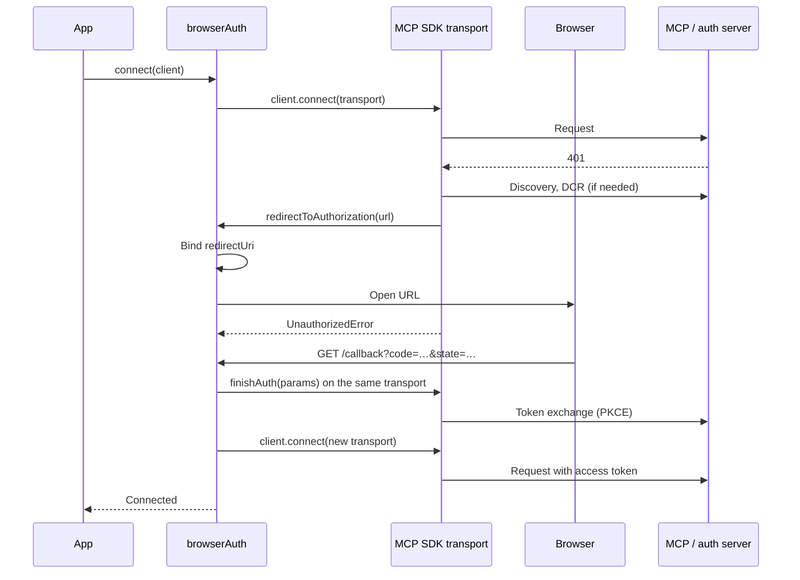

# Core Concepts {#top}

## The redirect URI

The redirect URI is the one address option. It must be `http:` on `127.0.0.1`, `[::1]` or `localhost`, with no fragment, credentials, duplicate query keys, or callback parameters (`state`, `code`, `error`, `error_description`, `error_uri`, `iss`) in its query. The library listens on it; when the authorization request carries `redirect_uri`, it must be the same value.

`getAuthCode()` accepts the authorization request in two forms:

```ts
// Builder (recommended): called after the listener binds
await getAuthCode(({ redirectUri, state, signal }) =>
  buildUrl(redirectUri, state),
);

// Prebuilt URL: listens on its redirect_uri, appends state if missing
await getAuthCode(
  "https://auth.example.com/authorize?client_id=app&redirect_uri=http%3A%2F%2F127.0.0.1%3A8765%2Fcallback",
);

// Prebuilt URL without redirect_uri (the provider uses its registered one)
await getAuthCode(authUrl, { redirectUri: "http://127.0.0.1:8765/callback" });
```

**Builder form.** The default redirect URI is `http://127.0.0.1:0/callback`: port 0 means the OS assigns a free port ([RFC 8252 §7.3](https://www.rfc-editor.org/rfc/rfc8252.html#section-7.3)), so the URL can only be built after binding. The builder receives the bound `redirectUri`, a fresh `state` and the flow's `signal`. `redirect_uri` and `state` are appended when absent and must match when present.

**URL form.** The library listens on the URL's `redirect_uri`, or on the `redirectUri` option when the URL has none. Port 0 is not allowed: the provider must already know the port.

**PAR/JAR.** Pushed and signed requests carry `redirect_uri` and `state` inside the request object, so only the builder form supports them. Put the provided values into the pushed request and return the short URL; pass `signal` to `fetch`.

```ts
const { code, redirectUri } = await getAuthCode(
  async ({ redirectUri, state, signal }) => {
    const res = await fetch(PAR_ENDPOINT, {
      method: "POST",
      body: new URLSearchParams({
        client_id,
        redirect_uri: redirectUri.href,
        state,
        code_challenge,
        code_challenge_method: "S256",
      }),
      signal,
    });
    const { request_uri } = await res.json();
    return `${AUTHORIZE}?client_id=${client_id}&request_uri=${encodeURIComponent(request_uri)}`;
  },
);
```

**`localhost`.** Accepted, never generated ([RFC 8252 §8.3](https://www.rfc-editor.org/rfc/rfc8252.html#section-8.3)). A `localhost` redirect URI listens on `127.0.0.1`.

The result's `redirectUri` is the exact redirect URI of the flow, never re-serialized. When the authorization request carried `redirect_uri` (always with a builder), send it verbatim in the token request ([RFC 6749 §4.1.3](https://www.rfc-editor.org/rfc/rfc6749.html#section-4.1.3)). A prebuilt URL without `redirect_uri` relies on the provider's registered URI; follow the provider's rules for the token request.

## State and callback validation

Every flow has a `state`: 32 random bytes, base64url. A prebuilt URL may bring its own.

The listener accepts a callback only when it is unambiguously this flow's:

- `GET` on the exact redirect path, with the redirect URI's own query parameters
- exactly one `state`, equal to the flow's
- either `code` or `error` (not both, not empty), with no duplicated `code`, `error`, `error_description`, `error_uri` or `iss`

Anything else gets a 400 and the flow keeps waiting, so a stray or stale request can't end it. The first valid callback wins; later ones get a 400.

## Authorization URL validation

Every authorization URL is checked before any launcher sees it:

- `https:`, or `http:` on a loopback host
- no fragment or credentials
- `state`, `redirect_uri`, `response_type`, `response_mode`, `request` and `request_uri` at most once
- `response_type` absent or `code`, `response_mode` absent or `query`

Failures throw `TypeError`: for a prebuilt URL before anything binds, for a builder's URL before launch (the listener binds first).

## Launching the browser

`launch` receives the final URL: with `redirect_uri` and `state` in place, except a builder's PAR/JAR URL, which carries them in the pushed request. The default opens the system browser; the launcher is bundled and loaded lazily, so flows with a custom `launch` never load it.

The launcher's fulfillment is ignored: resolving doesn't mean the user finished. A throw or rejection fails the flow with that error.

```ts
await getAuthCode(build, { launch: (url) => console.log(`Open ${url}`) }); // headless / SSH
await getAuthCode(build, { launch: (url) => showQrCode(url) });
await getAuthCode(build, { launch: (url) => fetch(url) }); // tests against a mock server
```

## Timeout and cancellation

One signal drives every stage: your `signal` combined with `timeout` (default 300000 ms, an integer in [1, 2³¹−1]). It covers the builder, the launcher and the wait for the callback.

- **Timeout** rejects with a `DOMException` named `TimeoutError`.
- **Abort** rejects with `signal.reason`.

The listener closes in every case.

## Callback pages

The browser gets a neutral page: "Authorization response received. You can close this tab." or "Authorization failed. Return to the application for details." Callback data is never rendered, because `error_description` and `error_uri` are attacker-controllable until verified. Show details in your own UI.

`successHtml` and `errorHtml` replace the defaults and are served verbatim; there is no templating. Every response carries:

- `Content-Security-Policy: default-src 'none'; style-src 'unsafe-inline'; img-src data:; base-uri 'none'; form-action 'none'; frame-ancestors 'none'`
- `Cache-Control: no-store`
- `Referrer-Policy: no-referrer`
- `X-Content-Type-Options: nosniff`

The CSP forbids scripts, so custom pages should be HTML and CSS only.

## MCP authorization

`oauth-callback/mcp` splits the work with the MCP SDK (`@modelcontextprotocol/client`):

| MCP SDK                             | `browserAuth()`                    |
| ----------------------------------- | ---------------------------------- |
| Protected-resource and AS discovery | Opening the browser                |
| Dynamic Client Registration         | Loopback listener and `state`      |
| PKCE                                | Flow ownership and timeout         |
| Token exchange and refresh          | Credential persistence             |
| `iss` checks, client authentication | `connect()` with automatic retries |


```mermaid
sequenceDiagram
    participant App
    participant Auth as browserAuth
    participant SDK as MCP SDK transport
    participant Browser
    participant Server as MCP / auth server

    App->>Auth: connect(client)
    Auth->>SDK: client.connect(transport)
    SDK->>Server: Request
    Server-->>SDK: 401
    SDK->>Server: Discovery, DCR (if needed)
    SDK->>Auth: redirectToAuthorization(url)
    Auth->>Auth: Bind redirectUri
    Auth->>Browser: Open URL
    SDK-->>Auth: UnauthorizedError
    Browser->>Auth: GET /callback?code=…&state=…
    Auth->>SDK: finishAuth(params) on the same transport
    SDK->>Server: Token exchange (PKCE)
    Auth->>SDK: client.connect(new transport)
    SDK->>Server: Request with access token
    Auth-->>App: Connected
```

Key rules:

- **Fixed redirect URI.** `redirectUri` is required and can't use port 0: Dynamic Client Registration registers it.
- **One flow at a time.** A provider runs one interactive authorization at a time, from `state()` until its token exchange settles. Overlapping attempts fail fast instead of merging: `UnauthorizedError` on transports `connect()` created, a plain `Error` on your own transports, where only the originating transport may complete a flow.
- **Same transport.** A flow completes on the transport that received the 401/403, which holds the scope and resource metadata the exchange needs.
- **`timeout`** bounds one flow. `connect()` aborts its OAuth requests (discovery, registration, token exchange) at the deadline; `completeAuthorization()` can't interrupt your transport's `finishAuth()`, so give that transport a bounded `fetch`.

`connect(client)` resolves once the client is connected. For a client it already connected it is a no-op, after completing any pending step-up flow, so it is safe to call again on `UnauthorizedError`. It never closes a transport it didn't create. For your own transports, use `completeAuthorization(transport)`.

## Credential storage

A `CredentialStore` persists one opaque string: `load()` and `save(text)`. The adapter owns the format (`{ version: 1, serverUrl, client?, tokens? }`), so a custom store never deals with OAuth records.

- **Default:** memory, for the process lifetime.
- **`fileStore(path)`:** an absolute path, written atomically, with 0600 permissions on POSIX. No cross-process locking: one file per process.
- **Custom:** e.g. the OS keychain.

Use one store per MCP server: tokens are audience-bound ([RFC 8707](https://www.rfc-editor.org/rfc/rfc8707.html)), and a store holding another server's credentials throws. The PKCE verifier, `state` and discovery state stay in memory. See [CredentialStore](/api/credential-store).

## Runtimes

One `node:http` implementation serves Node.js 22+, Deno 2 and Bun 1.2+. The package has zero runtime dependencies. `browserAuth()` additionally depends on the runtime support of `@modelcontextprotocol/client`.

## Further reading

- [ADRs](/adr/) record the rationale behind these rules, in particular [ADR-006](/adr/006-mcp-sdk-owns-oauth), [ADR-007](/adr/007-redirect-uri-and-builder) and [ADR-008](/adr/008-neutral-callback-pages).
