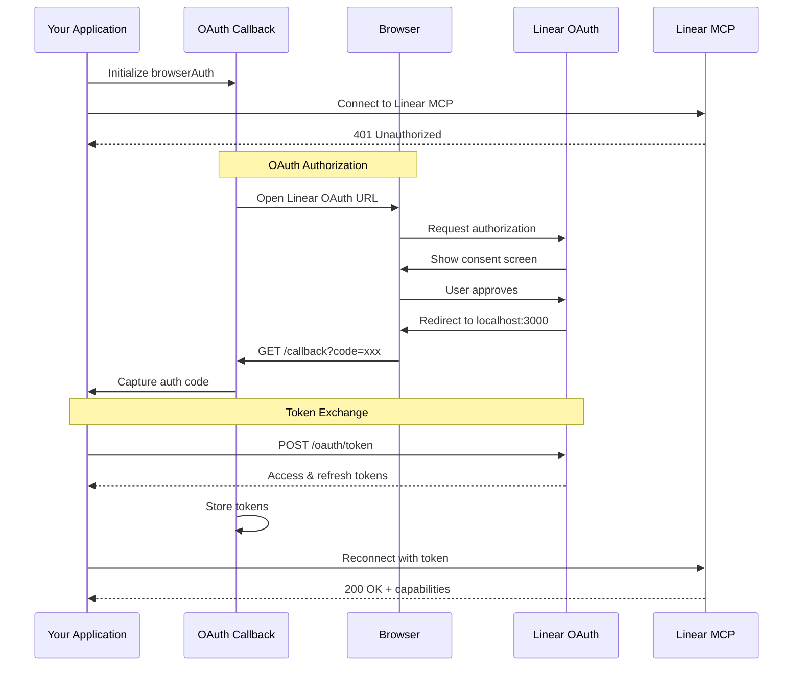

# Linear MCP Example

This example demonstrates how to integrate with Linear's Model Context Protocol (MCP) server using OAuth Callback's `browserAuth()` provider. Linear is a modern issue tracking and project management tool designed for high-performance teams. Through MCP integration, you can programmatically manage issues, projects, cycles, and more.

## Overview

The Linear MCP integration enables powerful project management automation:

- **Issue Management** - Create, update, and track issues programmatically
- **Project Tracking** - Monitor project progress and milestones
- **Cycle Management** - Work with sprints and development cycles
- **Team Collaboration** - Access team data and workflows
- **Real-time Updates** - Subscribe to changes via MCP resources

## Prerequisites

Before starting with Linear MCP integration:

- **Runtime Environment** - Bun, Node.js 18+, or Deno installed
- **Linear Account** - Active Linear workspace with API access
- **OAuth Application** - Linear OAuth app configured (or use DCR if supported)
- **Port Availability** - Port 3000 (or custom) for OAuth callback
- **Browser Access** - Default browser for authorization flow

## Installation

Install the required dependencies:

::: code-group

```bash [Bun]
bun add oauth-callback @modelcontextprotocol/sdk
```

```bash [npm]
npm install oauth-callback @modelcontextprotocol/sdk
```

```bash [pnpm]
pnpm add oauth-callback @modelcontextprotocol/sdk
```

:::

## Linear OAuth Setup

### Creating a Linear OAuth Application

1. Navigate to [Linear Settings > API](https://linear.app/settings/api)
2. Click "Create new OAuth application"
3. Configure your application:
   - **Application name**: Your app name
   - **Redirect URI**: `http://localhost:3000/callback`
   - **Scopes**: Select required permissions (read, write, admin)
4. Save your credentials:
   - Client ID
   - Client Secret

### Required Scopes

Select scopes based on your needs:

| Scope             | Description                                |
| ----------------- | ------------------------------------------ |
| `read`            | Read access to issues, projects, and teams |
| `write`           | Create and modify issues and comments      |
| `admin`           | Manage team settings and workflows         |
| `issues:create`   | Create new issues                          |
| `issues:update`   | Update existing issues                     |
| `comments:create` | Add comments to issues                     |

## Basic Implementation

### Simple Linear Connection

Here's a basic example connecting to Linear's MCP server:

```typescript
import { Client } from "@modelcontextprotocol/sdk/client/index.js";
import { StreamableHTTPClientTransport } from "@modelcontextprotocol/sdk/client/streamableHttp.js";
import { browserAuth, fileStore } from "oauth-callback/mcp";

async function connectToLinear() {
  console.log("🚀 Connecting to Linear MCP Server\n");

  // Linear MCP endpoint (hypothetical - check Linear docs)
  const serverUrl = new URL("https://mcp.linear.app");

  // Create OAuth provider with credentials
  const authProvider = browserAuth({
    clientId: process.env.LINEAR_CLIENT_ID,
    clientSecret: process.env.LINEAR_CLIENT_SECRET,
    scope: "read write issues:create issues:update",
    port: 3000,
    store: fileStore("~/.mcp/linear-tokens.json"),
    onRequest(req) {
      console.log(`[OAuth] ${new URL(req.url).pathname}`);
    },
  });

  try {
    // Create MCP transport
    const transport = new StreamableHTTPClientTransport(serverUrl, {
      authProvider,
    });

    // Initialize MCP client
    const client = new Client(
      { name: "linear-automation", version: "1.0.0" },
      { capabilities: {} },
    );

    // Connect to Linear
    await client.connect(transport);
    console.log("✅ Connected to Linear MCP!");

    // List available capabilities
    const tools = await client.listTools();
    console.log("\n📝 Available tools:", tools);

    await client.close();
  } catch (error) {
    console.error("❌ Connection failed:", error);
  }
}

connectToLinear();
```

## OAuth Flow Details

### Authorization Flow Diagram



### Configuration Options

Configure the OAuth provider for Linear:

```typescript
const authProvider = browserAuth({
  // OAuth credentials
  clientId: process.env.LINEAR_CLIENT_ID,
  clientSecret: process.env.LINEAR_CLIENT_SECRET,

  // Required permissions
  scope: "read write issues:create issues:update comments:create",

  // Server configuration
  port: 3000,
  hostname: "localhost",
  callbackPath: "/callback",

  // Token storage
  store: fileStore("~/.mcp/linear.json"),
  storeKey: "linear-production",

  // Timeouts
  authTimeout: 300000, // 5 minutes

  // Security
  usePKCE: true, // Recommended for public clients

  // Debugging
  onRequest(req) {
    const url = new URL(req.url);
    console.log(`[${new Date().toISOString()}] ${req.method} ${url.pathname}`);
  },
});
```

## Working with Linear MCP

### Issue Management

Create and manage Linear issues through MCP:

```typescript
// Create a new issue
const newIssue = await client.callTool("create_issue", {
  title: "Fix authentication bug",
  description: "Users unable to login with SSO",
  teamId: "ENG",
  priority: 1, // Urgent
  labelIds: ["bug", "authentication"],
  assigneeId: "user_123",
});

console.log("Created issue:", newIssue.identifier);

// Update issue status
await client.callTool("update_issue", {
  issueId: newIssue.id,
  stateId: "in_progress",
});

// Add a comment
await client.callTool("add_comment", {
  issueId: newIssue.id,
  body: "Started investigation - found root cause in SSO handler",
});

// Search for issues
const searchResults = await client.callTool("search_issues", {
  query: "authentication bug",
  teamId: "ENG",
  state: ["todo", "in_progress"],
  limit: 10,
});
```

### Project Management

Work with Linear projects and milestones:

```typescript
// Get project details
const project = await client.callTool("get_project", {
  projectId: "PROJ-123",
});

// Update project progress
await client.callTool("update_project", {
  projectId: "PROJ-123",
  progress: 0.75, // 75% complete
  status: "on_track",
});

// List project issues
const projectIssues = await client.callTool("list_project_issues", {
  projectId: "PROJ-123",
  includeArchived: false,
});

// Create milestone
const milestone = await client.callTool("create_milestone", {
  name: "v2.0 Release",
  targetDate: "2024-06-01",
  projectId: "PROJ-123",
});
```

### Cycle Management

Manage development cycles (sprints):

```typescript
// Get current cycle
const currentCycle = await client.callTool("get_current_cycle", {
  teamId: "ENG",
});

// List cycle issues
const cycleIssues = await client.callTool("list_cycle_issues", {
  cycleId: currentCycle.id,
});

// Move issue to next cycle
await client.callTool("update_issue", {
  issueId: "ISS-456",
  cycleId: currentCycle.nextCycle.id,
});

// Get cycle analytics
const analytics = await client.callTool("get_cycle_analytics", {
  cycleId: currentCycle.id,
});

console.log("Cycle completion:", analytics.completionRate);
console.log("Issues completed:", analytics.completedCount);
```

### Resource Subscriptions

Subscribe to Linear resources for real-time updates:

```typescript
// Subscribe to team updates
await client.subscribeToResource({
  uri: "linear://team/ENG",
});

// Subscribe to project changes
await client.subscribeToResource({
  uri: "linear://project/PROJ-123",
});

// Handle resource updates
client.on("resource_updated", (resource) => {
  console.log("Resource updated:", resource.uri);

  if (resource.uri.startsWith("linear://issue/")) {
    console.log("Issue changed:", resource.data);
  }
});
```

## Advanced Patterns

### Custom Linear Client Class

Create a reusable Linear MCP client:

```typescript
import { Client } from "@modelcontextprotocol/sdk/client/index.js";
import { StreamableHTTPClientTransport } from "@modelcontextprotocol/sdk/client/streamableHttp.js";
import { browserAuth, fileStore } from "oauth-callback/mcp";

class LinearMCPClient {
  private client?: Client;
  private authProvider: any;

  constructor(options?: {
    clientId?: string;
    clientSecret?: string;
    storePath?: string;
  }) {
    this.authProvider = browserAuth({
      clientId: options?.clientId || process.env.LINEAR_CLIENT_ID,
      clientSecret: options?.clientSecret || process.env.LINEAR_CLIENT_SECRET,
      scope: "read write issues:create issues:update",
      store: fileStore(options?.storePath || "~/.mcp/linear.json"),
      port: 3000,
      authTimeout: 300000,
    });
  }

  async connect(): Promise<void> {
    const serverUrl = new URL("https://mcp.linear.app");

    const transport = new StreamableHTTPClientTransport(serverUrl, {
      authProvider: this.authProvider,
    });

    this.client = new Client(
      { name: "linear-client", version: "1.0.0" },
      { capabilities: {} },
    );

    await this.client.connect(transport);
    console.log("✅ Connected to Linear MCP");
  }

  async createIssue(params: {
    title: string;
    description?: string;
    teamId: string;
    priority?: number;
    labels?: string[];
  }): Promise<any> {
    if (!this.client) throw new Error("Not connected");

    return await this.client.callTool("create_issue", {
      title: params.title,
      description: params.description,
      teamId: params.teamId,
      priority: params.priority || 3,
      labelIds: params.labels || [],
    });
  }

  async searchIssues(query: string, teamId?: string): Promise<any> {
    if (!this.client) throw new Error("Not connected");

    return await this.client.callTool("search_issues", {
      query,
      teamId,
      limit: 20,
    });
  }

  async updateIssueStatus(issueId: string, status: string): Promise<void> {
    if (!this.client) throw new Error("Not connected");

    const states = {
      todo: "state_todo_id",
      in_progress: "state_in_progress_id",
      done: "state_done_id",
      cancelled: "state_cancelled_id",
    };

    await this.client.callTool("update_issue", {
      issueId,
      stateId: states[status] || status,
    });
  }

  async addComment(issueId: string, comment: string): Promise<any> {
    if (!this.client) throw new Error("Not connected");

    return await this.client.callTool("add_comment", {
      issueId,
      body: comment,
    });
  }

  async disconnect(): Promise<void> {
    if (this.client) {
      await this.client.close();
      this.client = undefined;
    }
  }
}

// Usage
const linear = new LinearMCPClient();
await linear.connect();

const issue = await linear.createIssue({
  title: "Implement OAuth integration",
  description: "Add OAuth support for third-party services",
  teamId: "ENG",
  priority: 2,
  labels: ["feature", "authentication"],
});

await linear.updateIssueStatus(issue.id, "in_progress");
await linear.addComment(issue.id, "Started implementation");
await linear.disconnect();
```

### Automation Workflows

Build powerful automations with Linear MCP:

```typescript
// Auto-triage incoming issues
async function autoTriageIssues(client: Client) {
  // Get untriaged issues
  const untriaged = await client.callTool("search_issues", {
    query: "no:assignee no:priority",
    state: ["todo"],
    limit: 50,
  });

  for (const issue of untriaged.issues) {
    // Analyze issue content
    const keywords =
      issue.title.toLowerCase() + " " + issue.description.toLowerCase();

    // Auto-assign based on keywords
    let assignee = null;
    let priority = 3; // Default: Medium

    if (keywords.includes("crash") || keywords.includes("down")) {
      priority = 1; // Urgent
      assignee = "oncall_engineer";
    } else if (
      keywords.includes("security") ||
      keywords.includes("vulnerability")
    ) {
      priority = 1;
      assignee = "security_team";
    } else if (keywords.includes("performance") || keywords.includes("slow")) {
      priority = 2; // High
      assignee = "performance_team";
    }

    // Update issue
    await client.callTool("update_issue", {
      issueId: issue.id,
      priority,
      assigneeId: assignee,
      labelIds: ["auto-triaged"],
    });

    console.log(
      `Triaged: ${issue.identifier} -> P${priority} ${assignee || "unassigned"}`,
    );
  }
}

// Sync Linear issues with external systems
async function syncWithJira(client: Client, jiraClient: any) {
  // Get recent Linear issues
  const recentIssues = await client.callTool("search_issues", {
    createdAfter: new Date(Date.now() - 86400000).toISOString(), // Last 24h
    limit: 100,
  });

  for (const issue of recentIssues.issues) {
    // Check if already synced
    if (issue.metadata?.jiraKey) continue;

    // Create in Jira
    const jiraIssue = await jiraClient.createIssue({
      summary: issue.title,
      description: issue.description,
      issueType: "Task",
      project: "PROJ",
    });

    // Update Linear with Jira reference
    await client.callTool("update_issue", {
      issueId: issue.id,
      metadata: {
        jiraKey: jiraIssue.key,
        syncedAt: new Date().toISOString(),
      },
    });

    // Add sync comment
    await client.callTool("add_comment", {
      issueId: issue.id,
      body: `🔄 Synced to Jira: [${jiraIssue.key}](https://jira.example.com/browse/${jiraIssue.key})`,
    });
  }
}
```

### Batch Operations

Efficiently handle multiple operations:

```typescript
class LinearBatchProcessor {
  constructor(private client: Client) {}

  async batchCreateIssues(
    issues: Array<{
      title: string;
      description?: string;
      teamId: string;
    }>,
  ): Promise<any[]> {
    const results = [];

    // Process in parallel with concurrency limit
    const batchSize = 5;
    for (let i = 0; i < issues.length; i += batchSize) {
      const batch = issues.slice(i, i + batchSize);
      const promises = batch.map((issue) =>
        this.client.callTool("create_issue", issue),
      );

      const batchResults = await Promise.all(promises);
      results.push(...batchResults);

      console.log(
        `Created batch ${i / batchSize + 1}: ${batchResults.length} issues`,
      );
    }

    return results;
  }

  async bulkUpdatePriority(
    issueIds: string[],
    priority: number,
  ): Promise<void> {
    const promises = issueIds.map((id) =>
      this.client.callTool("update_issue", {
        issueId: id,
        priority,
      }),
    );

    await Promise.all(promises);
    console.log(`Updated priority for ${issueIds.length} issues`);
  }

  async archiveCompletedIssues(
    teamId: string,
    olderThanDays = 30,
  ): Promise<number> {
    const cutoffDate = new Date();
    cutoffDate.setDate(cutoffDate.getDate() - olderThanDays);

    const completed = await this.client.callTool("search_issues", {
      teamId,
      state: ["done", "cancelled"],
      completedBefore: cutoffDate.toISOString(),
      limit: 100,
    });

    for (const issue of completed.issues) {
      await this.client.callTool("archive_issue", {
        issueId: issue.id,
      });
    }

    return completed.issues.length;
  }
}
```

## Error Handling

### Common Error Scenarios

Handle Linear-specific errors gracefully:

```typescript
async function robustLinearOperation(
  client: Client,
  operation: () => Promise<any>,
) {
  const maxRetries = 3;
  let lastError;

  for (let attempt = 1; attempt <= maxRetries; attempt++) {
    try {
      return await operation();
    } catch (error: any) {
      lastError = error;

      // Handle specific Linear errors
      if (error.message.includes("RATE_LIMITED")) {
        // Rate limit - exponential backoff
        const delay = Math.pow(2, attempt) * 1000;
        console.log(`Rate limited. Waiting ${delay}ms...`);
        await new Promise((resolve) => setTimeout(resolve, delay));
        continue;
      }

      if (error.message.includes("INVALID_TEAM_ID")) {
        throw new Error(
          "Invalid team ID. Check your Linear workspace settings.",
        );
      }

      if (error.message.includes("INSUFFICIENT_PERMISSIONS")) {
        throw new Error(
          "Missing permissions. Request additional OAuth scopes.",
        );
      }

      if (error.message.includes("RESOURCE_NOT_FOUND")) {
        throw new Error("Linear resource not found. It may have been deleted.");
      }

      // Network errors - retry
      if (
        error.message.includes("ECONNRESET") ||
        error.message.includes("ETIMEDOUT")
      ) {
        console.log(`Network error on attempt ${attempt}. Retrying...`);
        continue;
      }

      // Unknown error - don't retry
      throw error;
    }
  }

  throw lastError;
}

// Usage
const result = await robustLinearOperation(client, async () => {
  return await client.callTool("create_issue", {
    title: "New feature request",
    teamId: "ENG",
  });
});
```

## Security Best Practices

### Token Management

Secure your Linear OAuth tokens:

```typescript
import { browserAuth, fileStore } from "oauth-callback/mcp";
import { createCipheriv, createDecipheriv, randomBytes, scrypt } from "crypto";
import { promisify } from "util";

// Encrypted token storage
class EncryptedLinearStore {
  private key: Buffer;
  private store = fileStore("~/.mcp/linear-encrypted.json");

  async init(password: string) {
    const salt = randomBytes(16);
    this.key = (await promisify(scrypt)(password, salt, 32)) as Buffer;
  }

  async get(key: string): Promise<any> {
    const encrypted = await this.store.get(key);
    if (!encrypted) return null;

    // Decrypt tokens
    return this.decrypt(encrypted);
  }

  async set(key: string, tokens: any): Promise<void> {
    // Encrypt before storing
    const encrypted = this.encrypt(tokens);
    await this.store.set(key, encrypted);
  }

  private encrypt(data: any): string {
    const iv = randomBytes(16);
    const cipher = createCipheriv("aes-256-gcm", this.key, iv);
    // ... encryption logic
    return encrypted;
  }

  private decrypt(encrypted: string): any {
    // ... decryption logic
    return decrypted;
  }
}
```

### Environment Configuration

Use environment variables for sensitive data:

```bash
# .env file (never commit!)
LINEAR_CLIENT_ID=lin_oauth_client_xxx
LINEAR_CLIENT_SECRET=lin_oauth_secret_xxx
LINEAR_WORKSPACE_ID=workspace_123
LINEAR_TEAM_ID=team_eng
```

```typescript
// Load configuration
import { config } from "dotenv";
config();

const authProvider = browserAuth({
  clientId: process.env.LINEAR_CLIENT_ID!,
  clientSecret: process.env.LINEAR_CLIENT_SECRET!,
  scope: "read write",
  store: fileStore(),
});
```

## Testing

### Mock Linear MCP Server

Test your integration without hitting Linear's API:

```typescript
import { createServer } from "http";

class MockLinearMCPServer {
  private server: any;
  private issues = new Map();

  async start(port = 4000) {
    this.server = createServer((req, res) => {
      // Mock MCP endpoints
      if (req.url === "/capabilities") {
        res.writeHead(200, { "Content-Type": "application/json" });
        res.end(
          JSON.stringify({
            tools: [
              { name: "create_issue", description: "Create issue" },
              { name: "update_issue", description: "Update issue" },
              { name: "search_issues", description: "Search issues" },
            ],
          }),
        );
      }
      // ... other endpoints
    });

    await new Promise((resolve) => {
      this.server.listen(port, resolve);
    });
  }

  async stop() {
    await new Promise((resolve) => this.server.close(resolve));
  }
}

// Test usage
describe("Linear MCP Integration", () => {
  let mockServer: MockLinearMCPServer;

  beforeAll(async () => {
    mockServer = new MockLinearMCPServer();
    await mockServer.start();
  });

  afterAll(async () => {
    await mockServer.stop();
  });

  it("should create an issue", async () => {
    // Test implementation
  });
});
```

## Troubleshooting

### Common Issues

::: details OAuth authorization fails

Check your Linear OAuth app configuration:

```typescript
// Verify redirect URI matches
const authProvider = browserAuth({
  clientId: "...",
  clientSecret: "...",
  port: 3000, // Must match redirect URI port
  callbackPath: "/callback", // Must match redirect URI path
});
```

:::

::: details Rate limiting errors

Implement rate limit handling:

```typescript
class RateLimitedClient {
  private requestCount = 0;
  private resetTime = Date.now() + 60000;

  async callTool(name: string, params: any) {
    // Check rate limit
    if (Date.now() > this.resetTime) {
      this.requestCount = 0;
      this.resetTime = Date.now() + 60000;
    }

    if (this.requestCount >= 100) {
      const waitTime = this.resetTime - Date.now();
      await new Promise((resolve) => setTimeout(resolve, waitTime));
      this.requestCount = 0;
    }

    this.requestCount++;
    return await this.client.callTool(name, params);
  }
}
```

:::

::: details Token refresh fails

Handle token refresh errors:

```typescript
const authProvider = browserAuth({
  store: fileStore(),
  onTokenRefreshError: async (error) => {
    console.error("Token refresh failed:", error);
    // Clear invalid tokens
    await authProvider.invalidateCredentials("tokens");
    // Trigger re-authentication
    throw new Error("Re-authentication required");
  },
});
```

:::

## Related Resources

- [Linear API Documentation](https://developers.linear.app/docs/graphql/working-with-the-graphql-api) - Official Linear API reference
- [browserAuth API](/api/browser-auth) - OAuth provider documentation
- [MCP SDK Documentation](https://modelcontextprotocol.io/docs) - Model Context Protocol reference
