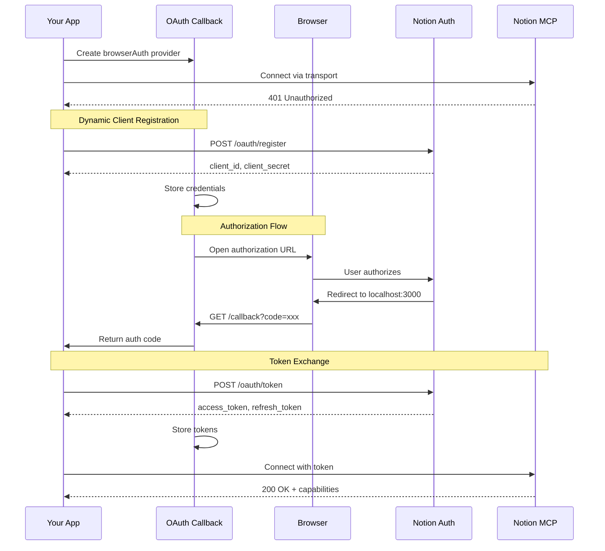

# Notion MCP Example

This example demonstrates how to connect to Notion's Model Context Protocol (MCP) server using OAuth Callback's `browserAuth()` provider with Dynamic Client Registration (DCR). Unlike traditional OAuth flows that require pre-registering an OAuth application, this example shows how to automatically register and authenticate with Notion's authorization server.

## Overview

The Notion MCP integration showcases several advanced features:

- **Dynamic Client Registration (RFC 7591)** - Automatic OAuth client registration
- **Model Context Protocol Integration** - Seamless MCP SDK authentication
- **Browser-Based Authorization** - Automatic browser opening for user consent
- **Token Management** - Automatic token storage and retrieval
- **Zero Configuration** - No client ID or secret required

## Prerequisites

Before running this example, ensure you have:

- **Bun, Node.js 18+, or Deno** installed
- **Port 3000** available for the OAuth callback server
- **Default browser** configured for opening authorization URLs
- **Internet connection** to reach Notion's servers

## Installation

Install the required dependencies:

::: code-group

```bash [Bun]
bun add oauth-callback @modelcontextprotocol/sdk
```

```bash [npm]
npm install oauth-callback @modelcontextprotocol/sdk
```

```bash [pnpm]
pnpm add oauth-callback @modelcontextprotocol/sdk
```

:::

## Quick Start

### Running the Example

The simplest way to run the Notion MCP example:

```bash
# Clone the repository
git clone https://github.com/kriasoft/oauth-callback.git
cd oauth-callback

# Install dependencies
bun install

# Run the Notion example
bun run example:notion
```

The example will:

1. Start a local OAuth callback server on port 3000
2. Open your browser to Notion's authorization page
3. Capture the authorization code after you approve
4. Exchange the code for access tokens
5. Connect to Notion's MCP server
6. Display available tools and resources

## Complete Example Code

Here's the full implementation demonstrating Notion MCP integration:

```typescript
#!/usr/bin/env bun
import { Client } from "@modelcontextprotocol/sdk/client/index.js";
import { StreamableHTTPClientTransport } from "@modelcontextprotocol/sdk/client/streamableHttp.js";
import { browserAuth, inMemoryStore } from "oauth-callback/mcp";

async function connectToNotion() {
  console.log("🚀 Starting OAuth flow with Notion MCP Server\n");

  const serverUrl = new URL("https://mcp.notion.com/mcp");

  // Create OAuth provider - no client_id or client_secret needed!
  const authProvider = browserAuth({
    port: 3000,
    scope: "read write",
    store: inMemoryStore(), // Use fileStore() for persistence
    onRequest(req) {
      const url = new URL(req.url);
      console.log(`📨 OAuth: ${req.method} ${url.pathname}`);
    },
  });

  try {
    // Create MCP transport with OAuth provider
    const transport = new StreamableHTTPClientTransport(serverUrl, {
      authProvider,
    });

    // Create MCP client
    const client = new Client(
      { name: "notion-example", version: "1.0.0" },
      { capabilities: {} },
    );

    // Connect triggers OAuth flow if needed
    await client.connect(transport);
    console.log("✅ Connected to Notion MCP server!");

    // List available tools
    const tools = await client.listTools();
    console.log("\n📝 Available tools:");
    for (const tool of tools.tools || []) {
      console.log(`   - ${tool.name}: ${tool.description}`);
    }

    // List available resources
    const resources = await client.listResources();
    console.log("\n📂 Available resources:");
    for (const resource of resources.resources || []) {
      console.log(`   - ${resource.uri}: ${resource.name}`);
    }

    await client.close();
  } catch (error) {
    console.error("❌ Connection failed:", error);
  }
}

connectToNotion();
```

## How It Works

### OAuth Flow Sequence



### Dynamic Client Registration

Unlike traditional OAuth, Notion's MCP server supports Dynamic Client Registration (RFC 7591):

1. **No Pre-Registration** - You don't need to manually register an OAuth app
2. **Automatic Registration** - The client registers itself on first use
3. **Credential Persistence** - Client credentials are stored for reuse
4. **Simplified Distribution** - Ship apps without OAuth setup instructions

## Key Features

### Browser-Based Authorization

The `browserAuth()` provider handles the complete OAuth flow:

```typescript
const authProvider = browserAuth({
  port: 3000, // Callback server port
  scope: "read write", // Requested permissions
  store: inMemoryStore(), // Token storage
  onRequest(req) {
    // Request logging
    console.log(`OAuth: ${req.url}`);
  },
});
```

### Token Storage Options

Choose between ephemeral and persistent storage:

::: code-group

```typescript [Ephemeral Storage]
// Tokens lost on restart (more secure)
const authProvider = browserAuth({
  store: inMemoryStore(),
});
```

```typescript [Persistent Storage]
// Tokens saved to disk (convenient)
import { fileStore } from "oauth-callback/mcp";

const authProvider = browserAuth({
  store: fileStore(), // Default: ~/.mcp/tokens.json
});
```

```typescript [Custom Location]
// Specify custom file path
const authProvider = browserAuth({
  store: fileStore("~/my-app/notion-tokens.json"),
});
```

:::

### Error Handling

Properly handle authentication failures:

```typescript
try {
  await client.connect(transport);
} catch (error) {
  if (error.message.includes("Unauthorized")) {
    console.log("Authorization required - check browser");
  } else if (error.message.includes("access_denied")) {
    console.log("User cancelled authorization");
  } else {
    console.error("Connection failed:", error);
  }
}
```

## Working with Notion MCP

### Available Tools

Once connected, you can use Notion's MCP tools:

```typescript
// Search for content
const searchResults = await client.callTool("search_objects", {
  query: "meeting notes",
  limit: 10,
});

// Create a new page
const newPage = await client.callTool("create_page", {
  title: "My New Page",
  content: "Page content here",
});

// Update existing content
const updated = await client.callTool("update_page", {
  page_id: "page-123",
  content: "Updated content",
});
```

### Available Resources

Access Notion resources through MCP:

```typescript
// List all resources
const resources = await client.listResources();

// Read a specific resource
const pageContent = await client.readResource({
  uri: "notion://page/page-123",
});

// Subscribe to changes
await client.subscribeToResource({
  uri: "notion://database/db-456",
});
```

## Advanced Configuration

### Custom Success Pages

Provide branded callback pages:

```typescript
const authProvider = browserAuth({
  successHtml: `
    <!DOCTYPE html>
    <html>
      <head>
        <title>Notion Connected!</title>
        <style>
          body {
            font-family: -apple-system, system-ui, sans-serif;
            display: flex;
            justify-content: center;
            align-items: center;
            height: 100vh;
            background: linear-gradient(135deg, #000000 0%, #434343 100%);
            color: white;
          }
        </style>
      </head>
      <body>
        <div>
          <h1>✨ Connected to Notion!</h1>
          <p>You can close this window and return to your app.</p>
        </div>
      </body>
    </html>
  `,
});
```

### Request Logging

Debug OAuth flow with detailed logging:

```typescript
const authProvider = browserAuth({
  onRequest(req) {
    const url = new URL(req.url);
    const timestamp = new Date().toISOString();

    console.log(`[${timestamp}] OAuth Request`);
    console.log(`  Method: ${req.method}`);
    console.log(`  Path: ${url.pathname}`);

    if (url.pathname === "/callback") {
      console.log(`  Code: ${url.searchParams.get("code")}`);
      console.log(`  State: ${url.searchParams.get("state")}`);
    }
  },
});
```

### Multi-Account Support

Support multiple Notion accounts:

```typescript
function createNotionAuth(accountName: string) {
  return browserAuth({
    store: fileStore(`~/.mcp/notion-${accountName}.json`),
    storeKey: `notion-${accountName}`,
    port: 3000 + Math.floor(Math.random() * 1000), // Random port
  });
}

// Use different accounts
const personalAuth = createNotionAuth("personal");
const workAuth = createNotionAuth("work");
```

## Troubleshooting

### Common Issues and Solutions

::: details Browser doesn't open automatically

If the browser doesn't open automatically:

```typescript
const authProvider = browserAuth({
  openBrowser: false, // Disable auto-open
});

// Manually instruct user
console.log("Please open this URL in your browser:");
console.log(authorizationUrl);
```

:::

::: details Port 3000 is already in use

Use a different port for the callback server:

```typescript
const authProvider = browserAuth({
  port: 8080, // Use alternative port
});
```

:::

::: details Tokens not persisting

Ensure you're using file storage, not in-memory:

```typescript
import { fileStore } from "oauth-callback/mcp";

const authProvider = browserAuth({
  store: fileStore(), // ✅ Persistent storage
  // store: inMemoryStore() // ❌ Lost on restart
});
```

:::

::: details Authorization fails repeatedly

Clear stored credentials and try again:

```typescript
// Clear all stored data
await authProvider.invalidateCredentials("all");

// Or clear specific data
await authProvider.invalidateCredentials("tokens");
await authProvider.invalidateCredentials("client");
```

:::

## Security Considerations

### Best Practices

1. **Use Ephemeral Storage for Sensitive Data**

   ```typescript
   // Tokens are never written to disk
   const authProvider = browserAuth({
     store: inMemoryStore(),
   });
   ```

2. **Validate State Parameter**
   - The library automatically generates and validates state parameters
   - Prevents CSRF attacks during authorization

3. **PKCE Protection**
   - Enabled by default for enhanced security
   - Prevents authorization code interception

4. **Secure File Permissions**
   - File storage uses mode 0600 (owner read/write only)
   - Tokens are protected from other users on the system

### Token Security

::: warning
Never commit tokens to version control:

```bash
# Add to .gitignore
~/.mcp/
*.json
tokens.json
```

:::

## Complete Working Example

For a production-ready implementation with full error handling:

```typescript
import { Client } from "@modelcontextprotocol/sdk/client/index.js";
import { StreamableHTTPClientTransport } from "@modelcontextprotocol/sdk/client/streamableHttp.js";
import { browserAuth, fileStore } from "oauth-callback/mcp";

class NotionMCPClient {
  private client?: Client;
  private authProvider: any;

  constructor() {
    this.authProvider = browserAuth({
      port: 3000,
      scope: "read write",
      store: fileStore("~/.mcp/notion.json"),
      authTimeout: 300000, // 5 minutes
      onRequest: this.logRequest.bind(this),
    });
  }

  private logRequest(req: Request) {
    const url = new URL(req.url);
    console.log(`[OAuth] ${req.method} ${url.pathname}`);
  }

  async connect(): Promise<void> {
    const serverUrl = new URL("https://mcp.notion.com/mcp");

    const transport = new StreamableHTTPClientTransport(serverUrl, {
      authProvider: this.authProvider,
    });

    this.client = new Client(
      { name: "notion-client", version: "1.0.0" },
      { capabilities: {} },
    );

    try {
      await this.client.connect(transport);
      console.log("✅ Connected to Notion MCP");
    } catch (error: any) {
      if (error.message.includes("Unauthorized")) {
        throw new Error("Authorization required. Please check your browser.");
      }
      throw error;
    }
  }

  async search(query: string): Promise<any> {
    if (!this.client) throw new Error("Not connected");

    return await this.client.callTool("search_objects", {
      query,
      limit: 10,
    });
  }

  async disconnect(): Promise<void> {
    if (this.client) {
      await this.client.close();
      this.client = undefined;
    }
  }
}

// Usage
async function main() {
  const notion = new NotionMCPClient();

  try {
    await notion.connect();

    const results = await notion.search("project roadmap");
    console.log("Search results:", results);

    await notion.disconnect();
  } catch (error) {
    console.error("Error:", error);
  }
}

main();
```

## Related Resources

- [browserAuth API Documentation](/api/browser-auth) - Complete API reference
- [Storage Providers](/api/storage-providers) - Token storage options
- [Core Concepts](/core-concepts) - OAuth and MCP architecture
- [GitHub Example](https://github.com/kriasoft/oauth-callback/blob/main/examples/notion.ts) - Source code
