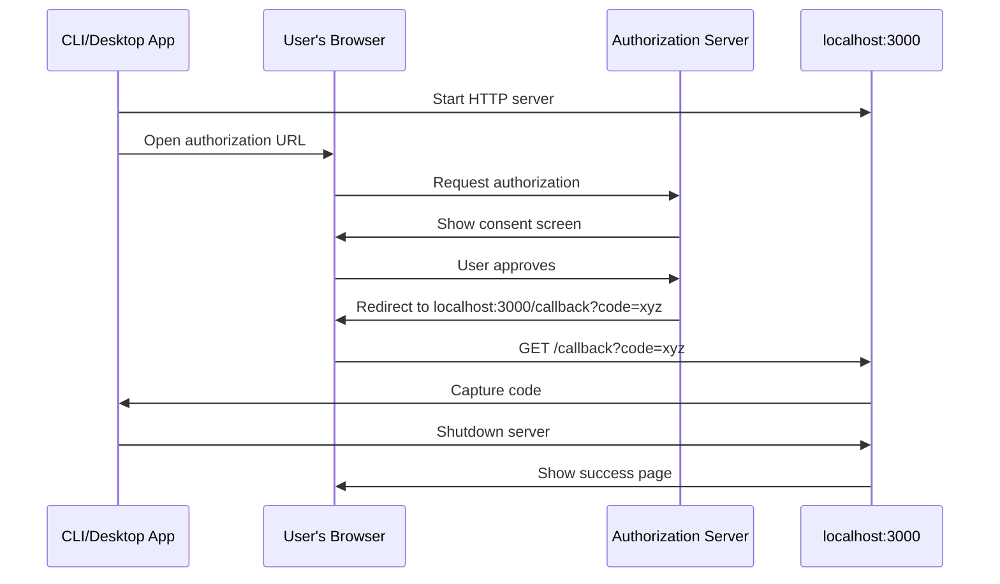
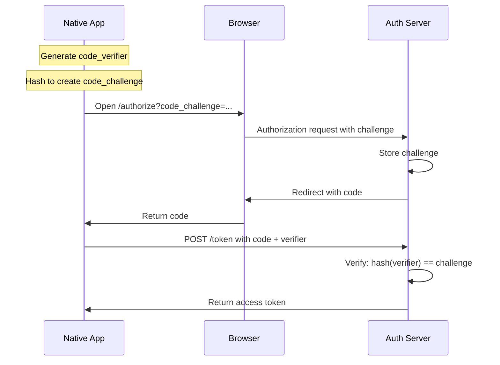
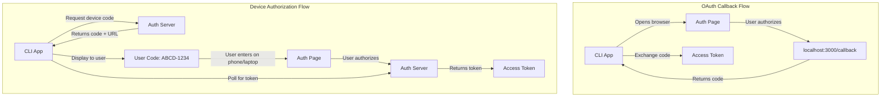
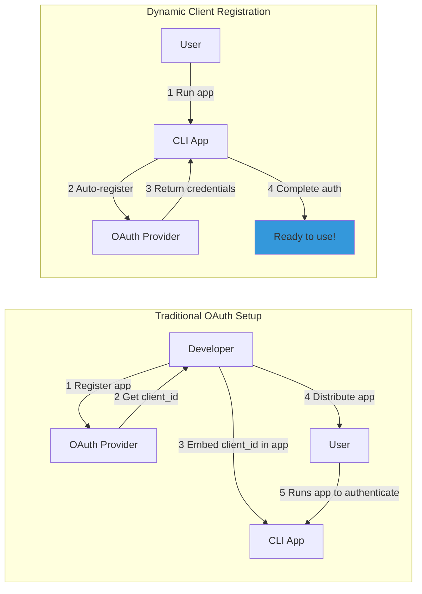

# What is OAuth Callback? {#top}

An OAuth callback is the mechanism that allows OAuth 2.0 authorization servers to return authorization codes to your application after user authentication. For native applications like CLI tools, desktop apps, and MCP clients, receiving this callback requires spinning up a temporary HTTP server on localhost — a process that **OAuth Callback** makes trivially simple with just one function call.

**OAuth Callback** is designed for developers building CLI tools, desktop applications, automation scripts, and Model Context Protocol (MCP) clients that need to capture OAuth authorization codes via a localhost callback. Whether you're automating workflows across services (Notion, Linear, GitHub), building developer tools, or creating MCP-enabled applications, **OAuth Callback** handles the complexity of the loopback redirect flow recommended by [RFC 8252](https://www.rfc-editor.org/rfc/rfc8252.html) while providing modern features like Dynamic Client Registration and flexible token storage — all with support for Node.js 18+, Deno, and Bun.

## Understanding OAuth Callbacks

### What is a Callback URL in OAuth 2.0?

In the OAuth 2.0 authorization code flow, the callback URL (also called redirect URI) is where the authorization server sends the user's browser after they approve or deny your application's access request. This URL receives critical information:

- **On success**: An authorization `code` parameter that your app exchanges for access tokens
- **On failure**: An `error` parameter describing what went wrong
- **Security parameters**: The `state` value for CSRF protection

For web applications, this callback is typically a route on your server. But for native applications without a public web server, you need a different approach.

### The Loopback Redirect Pattern

Native applications (CLIs, desktop apps) can't expose public URLs for callbacks. Instead, they use the **loopback interface** — a temporary HTTP server on `http://localhost` or `http://127.0.0.1`. This pattern, standardized in [RFC 8252](https://www.rfc-editor.org/rfc/rfc8252.html) (OAuth 2.0 for Native Apps), provides several benefits:

- **No public exposure**: The callback server only accepts local connections
- **Dynamic ports**: Apps can use any available port (e.g., 3000, 8080)
- **Automatic cleanup**: The server shuts down immediately after receiving the callback
- **Universal support**: Works across all platforms without special permissions

Here's how the flow works:



### Security Best Practices

OAuth 2.0 for native apps requires additional security measures:

**Proof Key for Code Exchange (PKCE)** - [RFC 7636](https://www.rfc-editor.org/rfc/rfc7636.html) mandates using PKCE for public clients (those without client secrets). PKCE prevents authorization code interception attacks by binding the code exchange to a cryptographic challenge.



**State Parameter** - A random value that prevents CSRF attacks. Your app generates this value, includes it in the authorization request, and validates it in the callback.

**Dynamic Client Registration (DCR)** - [RFC 7591](https://www.rfc-editor.org/rfc/rfc7591.html) allows apps to register OAuth clients on-the-fly without pre-configuration. This is particularly useful for MCP servers where users shouldn't need to manually register OAuth applications.

## How OAuth Callback Solves It

OAuth Callback eliminates the boilerplate of implementing loopback redirects. Instead of manually managing servers, ports, and browser launches, you get a complete solution in one function call.

### Core Functionality

The library handles the entire OAuth callback flow:

1. **Starts a localhost HTTP server** on your specified port
2. **Opens the user's browser** to the authorization URL
3. **Captures the callback** with the authorization code
4. **Returns the result** as a clean JavaScript object
5. **Shuts down the server** automatically

### Zero Configuration Example

Here's a complete OAuth flow in just 6 lines:

```typescript {3-5}
import { getAuthCode } from "oauth-callback";

const result = await getAuthCode(
  "https://github.com/login/oauth/authorize?client_id=xxx&redirect_uri=http://localhost:3000/callback",
);

console.log("Authorization code:", result.code);
```

That's it. No server setup, no browser management, no cleanup code.

### Cross-Runtime Support

OAuth Callback uses modern Web Standards APIs (Request, Response, URL) that work identically across:

- **Node.js 18+** - Native fetch and Web Streams support
- **Deno** - First-class Web Standards implementation
- **Bun** - High-performance runtime with built-in APIs

This means your OAuth code is portable across runtimes without modifications.

### MCP Integration

For Model Context Protocol applications, OAuth Callback provides the `browserAuth()` provider that integrates seamlessly with the MCP SDK:

::: code-group

```typescript [MCP with OAuth Callback]
import { browserAuth, fileStore } from "oauth-callback/mcp";
import { Client } from "@modelcontextprotocol/sdk/client/index.js";
import { StreamableHTTPClientTransport } from "@modelcontextprotocol/sdk/client/streamableHttp.js";

const authProvider = browserAuth({
  store: fileStore(), // Persist tokens to ~/.mcp/tokens.json
  scope: "read write",
});

// Use directly with MCP transports
const transport = new StreamableHTTPClientTransport(
  new URL("https://mcp.example.com"),
  { authProvider },
);
```

```typescript [Namespace Import]
import { mcp } from "oauth-callback";
import { Client } from "@modelcontextprotocol/sdk/client/index.js";

const authProvider = mcp.browserAuth({
  store: mcp.fileStore(),
  scope: "read write",
});
```

:::

::: tip MCP Integration Features
The MCP integration handles:

- **Dynamic Client Registration** when supported by the server
- **Token persistence** with `fileStore()` or ephemeral `inMemoryStore()`
- **Automatic token refresh** when tokens expire
- **Multiple app namespace support** via `storeKey` option
  :::

## When to Use OAuth Callback

### Perfect For

OAuth Callback is ideal when:

- **You control the user's machine** - CLI tools, desktop apps, development tools
- **You can open a browser** - The user has a default browser configured
- **You need quick setup** - No server infrastructure or complex configuration
- **You're building MCP clients** - Direct integration with Model Context Protocol SDK

### Consider Alternatives When

**Device Authorization Flow** ([RFC 8628](https://www.rfc-editor.org/rfc/rfc8628.html)) might be better if:

- **No browser access** - SSH sessions, headless servers, CI/CD environments
- **Remote terminals** - The auth happens on a different device than the app
- **Input-constrained devices** - Smart TVs, IoT devices without keyboards

The Device Flow shows a code to the user that they enter on another device, eliminating the need for a browser on the same machine. However, it requires OAuth provider support and a more complex user experience.



## Security Considerations

OAuth Callback implements security best practices by default:

::: info Security Features

- **Localhost-only binding** - The callback server only accepts connections from `127.0.0.1` or `::1`, preventing remote access attempts.
- **Automatic cleanup** - The HTTP server shuts down immediately after receiving the callback, minimizing the attack surface window.
- **No persistent state** - Server is ephemeral and leaves no traces after completion.

:::

::: warning Always Validate State
Always validate the `state` parameter returned in the callback matches what you sent:

```typescript {4-7}
const state = crypto.randomUUID();
const authUrl = `https://example.com/authorize?state=${state}&...`;

const result = await getAuthCode(authUrl);
if (result.state !== state) {
  throw new Error("State mismatch - possible CSRF attack");
}
```

:::

::: details Proof Key for Code Exchange (PKCE) Implementation
For public clients, implement Proof Key for Code Exchange as required by [RFC 7636](https://www.rfc-editor.org/rfc/rfc7636.html):

```typescript {3-4,7,10}
import { createHash, randomBytes } from "crypto";

const verifier = randomBytes(32).toString("base64url");
const challenge = createHash("sha256").update(verifier).digest("base64url");

// Include challenge in authorization request
const authUrl = `https://example.com/authorize?code_challenge=${challenge}&code_challenge_method=S256&...`;

// Include verifier in token exchange
const tokenResponse = await fetch(tokenUrl, {
  method: "POST",
  body: new URLSearchParams({
    code: result.code,
    code_verifier: verifier,
    // ... other parameters
  }),
});
```

:::

**Token storage choices** - Choose storage based on your security requirements:

::: code-group

```typescript [Ephemeral Storage]
// Tokens lost on restart (more secure)
import { browserAuth, inMemoryStore } from "oauth-callback/mcp";

const authProvider = browserAuth({
  store: inMemoryStore(),
});
```

```typescript [Persistent Storage]
// Tokens saved to disk (convenient)
import { browserAuth, fileStore } from "oauth-callback/mcp";

const authProvider = browserAuth({
  store: fileStore("~/.myapp/tokens.json"),
});
```

:::

## Requirements and Registration

### Prerequisites

::: details System Requirements

| Requirement           | Details                                                          |
| --------------------- | ---------------------------------------------------------------- |
| **Runtime**           | Node.js 18+, Deno, or Bun                                        |
| **OAuth Application** | Register your app with the OAuth provider                        |
| **Redirect URI**      | Configure `http://localhost:3000/callback` (or your chosen port) |
| **Browser**           | User must have a default browser configured                      |
| **Permissions**       | Ability to bind to localhost ports                               |

:::

### Standard OAuth Registration

Most OAuth providers require pre-registering your application:

1. Create an OAuth app in the provider's developer console
2. Set redirect URI to `http://localhost:3000/callback`
3. Copy your client ID (and secret if provided)
4. Use credentials in your code

### Dynamic Client Registration for MCP

Some MCP servers support Dynamic Client Registration ([RFC 7591](https://www.rfc-editor.org/rfc/rfc7591.html)), eliminating pre-registration:

::: tip No Pre-Registration Required

```typescript {1}
// No client_id or client_secret needed!
const authProvider = browserAuth({
  scope: "read write",
  store: fileStore(),
});
```

:::

The Notion MCP example demonstrates this — the server automatically registers your client on first use. This greatly simplifies distribution of MCP-enabled tools.


