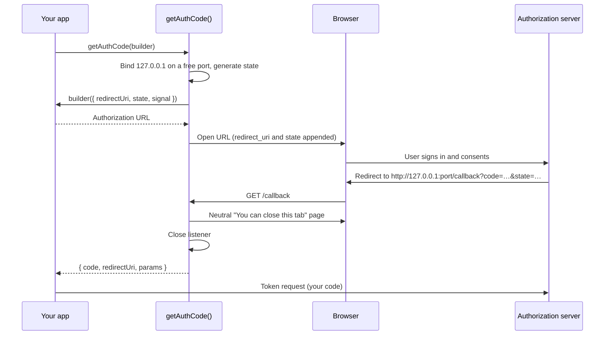

# What is OAuth Callback? {#top}

In the OAuth 2.0 authorization code flow, the authorization server sends the user's browser back to a **redirect URI** with a `code` (or an `error`) and the `state` your app sent. A web app handles that on a route of its server. A CLI tool or desktop app has no public server, so it listens on the **loopback interface** instead, as recommended by [RFC 8252](https://www.rfc-editor.org/rfc/rfc8252.html) (OAuth 2.0 for Native Apps).

**OAuth Callback** does exactly that part: it turns a browser authorization into a validated authorization code on a loopback redirect URI, in Node.js, Deno and Bun. For [Model Context Protocol](https://modelcontextprotocol.io) clients, `oauth-callback/mcp` adds a browser authorization provider for the MCP SDK.

## The loopback flow


```mermaid
sequenceDiagram
    participant App as Your app
    participant Lib as getAuthCode()
    participant Browser
    participant AS as Authorization server

    App->>Lib: getAuthCode(builder)
    Lib->>Lib: Bind 127.0.0.1 on a free port, generate state
    Lib->>App: builder({ redirectUri, state, signal })
    App-->>Lib: Authorization URL
    Lib->>Browser: Open URL (redirect_uri and state appended)
    Browser->>AS: User signs in and consents
    AS->>Browser: Redirect to http://127.0.0.1:port/callback?code=…&state=…
    Browser->>Lib: GET /callback
    Lib->>Browser: Neutral "You can close this tab" page
    Lib->>Lib: Close listener
    Lib-->>App: { code, redirectUri, params }
    App->>AS: Token request (your code)
```

`getAuthCode()` handles the listener, the `state`, the browser and the callback. Token exchange, PKCE and client secrets stay in your code, so it works with any provider. With `oauth-callback/mcp`, the MCP SDK does the OAuth work and the library supplies the browser side.

## What it handles

- **Redirect URI.** Binds `http://127.0.0.1:<free port>/callback` by default and calls your builder with it, so you never pick a port. A fixed `redirectUri` (including `localhost` or `[::1]`) works too.
- **State.** Every flow has one. Only a callback with exactly that `state` and an unambiguous `code` or `error` completes the flow; anything else gets a 400 and the flow keeps waiting.
- **URL validation.** The authorization URL must be `https:` (or loopback `http:`), with `response_type` absent or `code` and a query response mode. Unsafe URLs never reach a browser.
- **Browser.** Opens the system browser by default, or hands the URL to your `launch` function (headless, SSH, QR codes, tests).
- **Pages.** The browser sees a neutral page that never renders callback data, sent with `Content-Security-Policy`, `Cache-Control: no-store`, `Referrer-Policy: no-referrer` and `X-Content-Type-Options: nosniff`.
- **Cleanup.** A timeout (5 minutes by default) and an optional `AbortSignal` bound the flow; the listener always closes.

## MCP integration

```ts
import { Client } from "@modelcontextprotocol/client";
import { browserAuth } from "oauth-callback/mcp";

const auth = browserAuth({
  serverUrl: "https://mcp.notion.com/mcp",
  redirectUri: "http://127.0.0.1:8765/callback",
  clientName: "Acme CLI",
});

const client = new Client({ name: "acme", version: "1.0.0" });
await auth.connect(client);
```

The MCP SDK owns discovery, Dynamic Client Registration, PKCE, token exchange, refresh and issuer checks. `browserAuth()` owns the browser, the loopback listener, flow ownership and credential storage. See [browserAuth](/api/browser-auth).

## When to use it

Good fit:

- CLI tools and desktop apps that sign users in through their browser
- MCP clients connecting to OAuth-protected servers
- Scripts and dev tools that need a user's token once

Look elsewhere when:

- You run a web app with its own server: handle the redirect on a route
- There is no browser on the user's machine: the [device authorization grant](https://www.rfc-editor.org/rfc/rfc8628.html) fits better, though a custom `launch` that prints the URL covers many SSH cases
- You need machine-to-machine auth: use the client credentials grant

## Requirements

- Node.js 22+, Deno 2 or Bun 1.2+
- A browser on the user's machine
- An OAuth client whose redirect URIs include your loopback URI, e.g. `http://127.0.0.1/callback` for providers that allow any loopback port ([RFC 8252 §7.3](https://www.rfc-editor.org/rfc/rfc8252.html#section-7.3)), or a fixed `http://127.0.0.1:8765/callback`. MCP servers that support Dynamic Client Registration need no pre-registration.
- `@modelcontextprotocol/client` 2.1+ for `oauth-callback/mcp`

The package has zero runtime dependencies.

## Next steps

- [Getting Started](/getting-started)
- [Core Concepts](/core-concepts)
- [API Reference](/api/)
- [Migrating from v2](/migration-v3)
